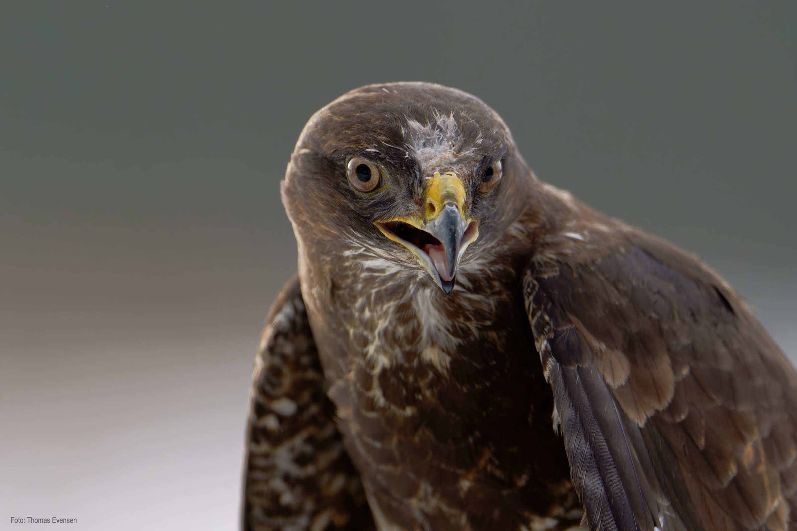
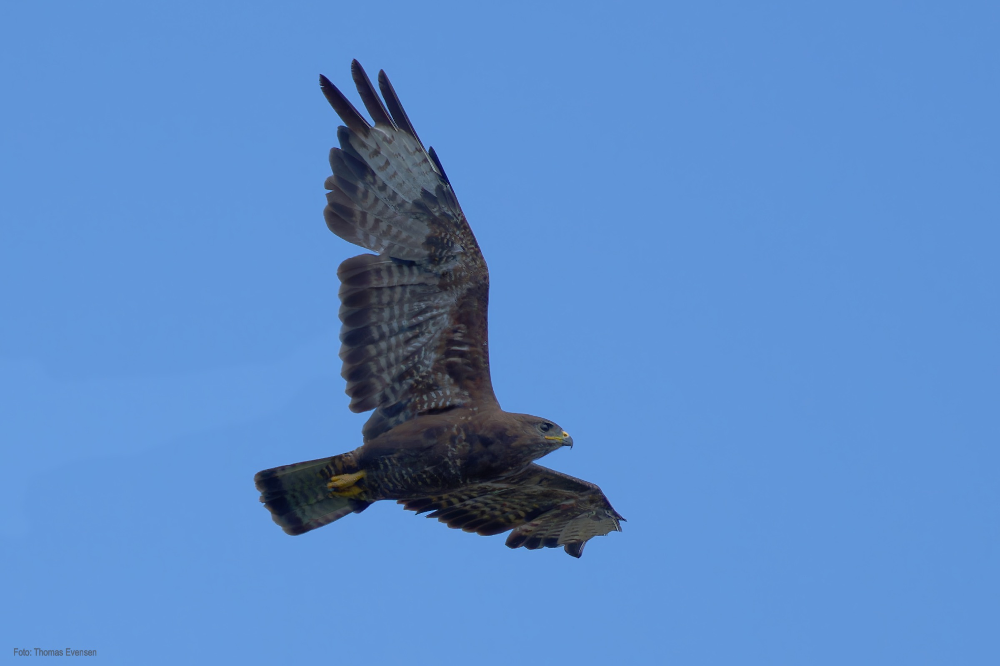
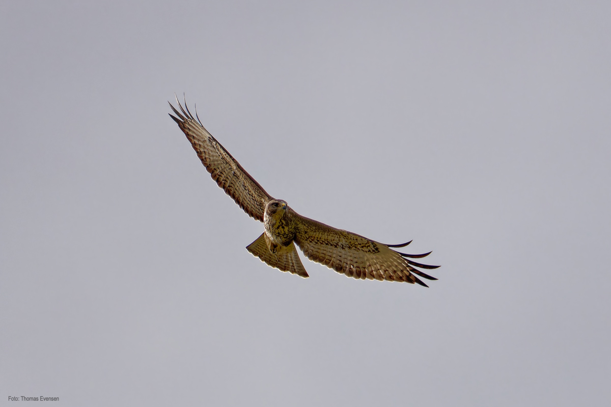

Common buzzard. The buzzard is a very common bird of prey in Eastern Norway.

| Latin      | UK | Norwegian |
| ----------- | ----------- |   ----------- |
| Buteo buteo |  [Common buzzard](https://en.wikipedia.org/wiki/Common_buzzard) |  [Musvåk](https://no.wikipedia.org/wiki/Musv%C3%A5k) |

