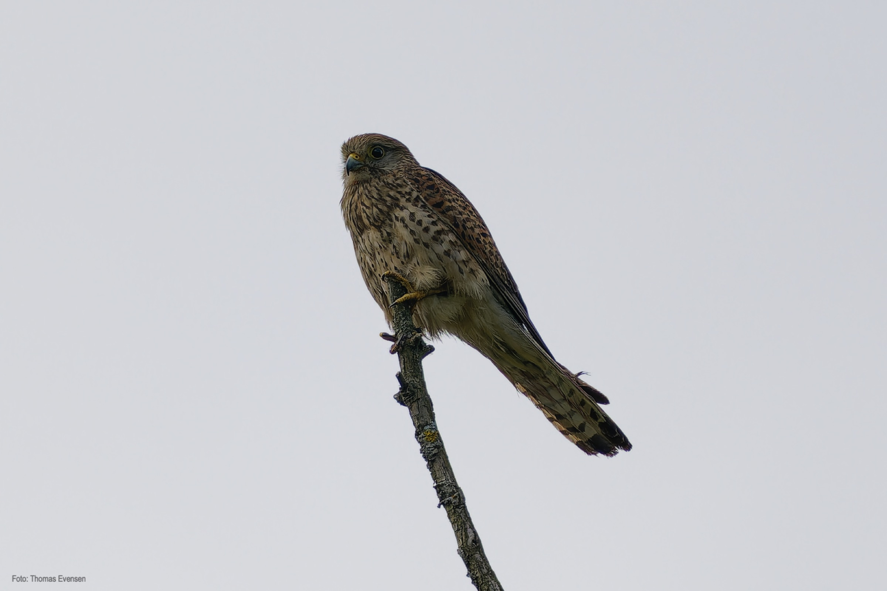
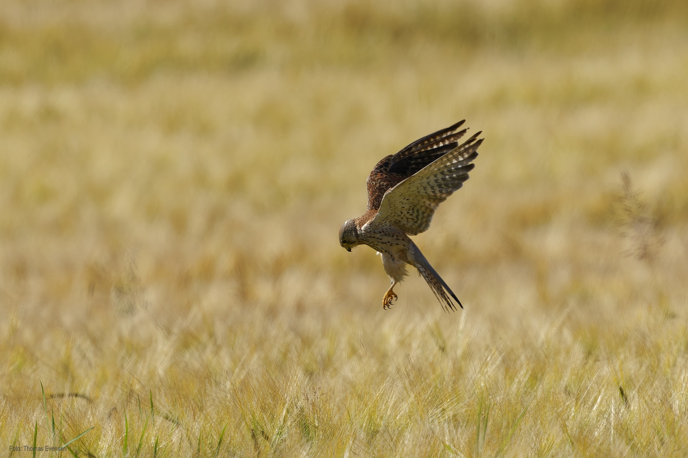
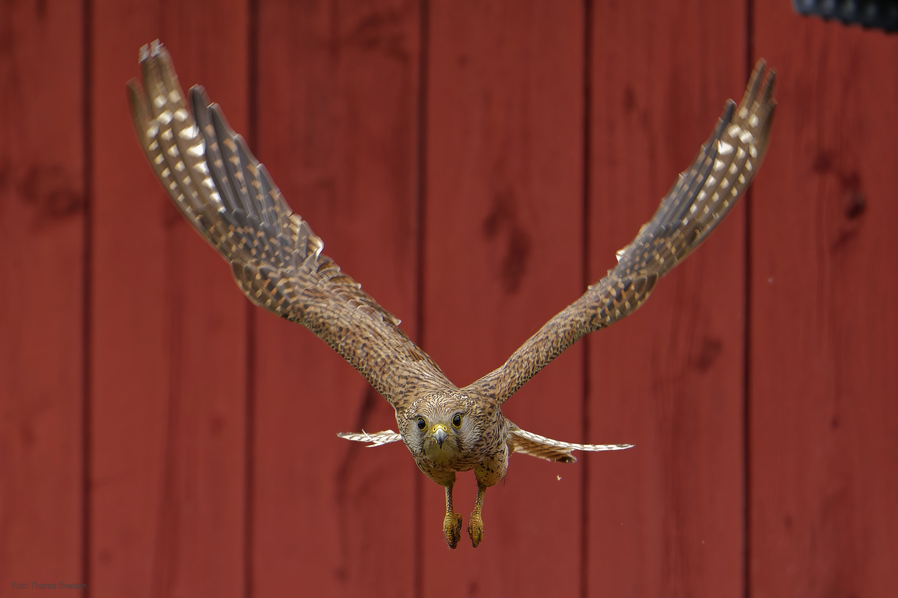
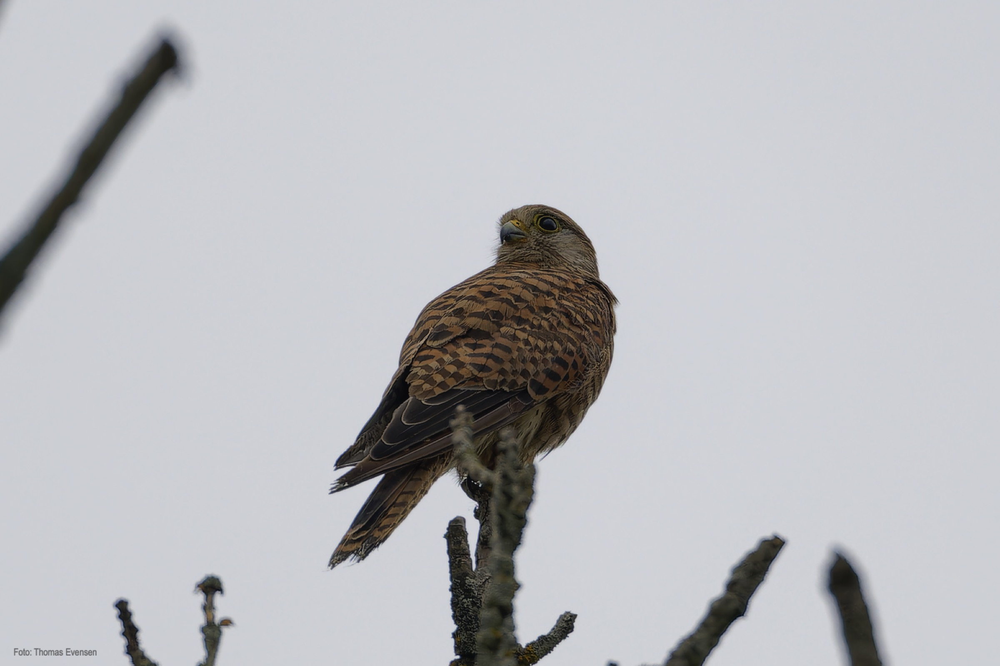
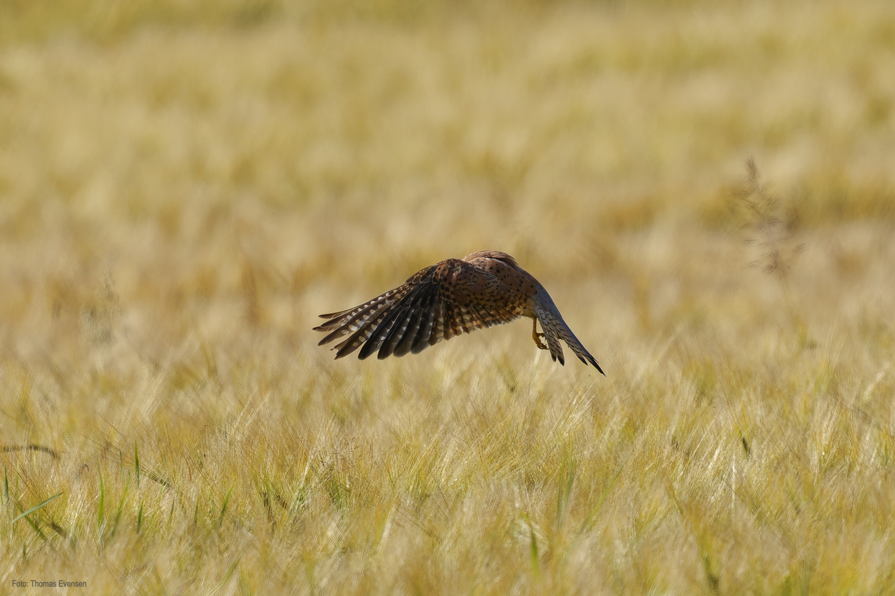

The common kestrel is a beautful, small bird of prey. It is quite common, both in at sealevel and in the mountains. I have observed
and photograped the common kestrel close to my home and to my cabin in the mountains.

| Latin      | UK | Norwegian |
| ----------- | ----------- |   ----------- |
|  Falco tinnunculus |  [Common kestrel](https://en.wikipedia.org/wiki/Common_kestrel) |  [Tårnfalk](https://no.wikipedia.org/wiki/Tårnfalk) |

