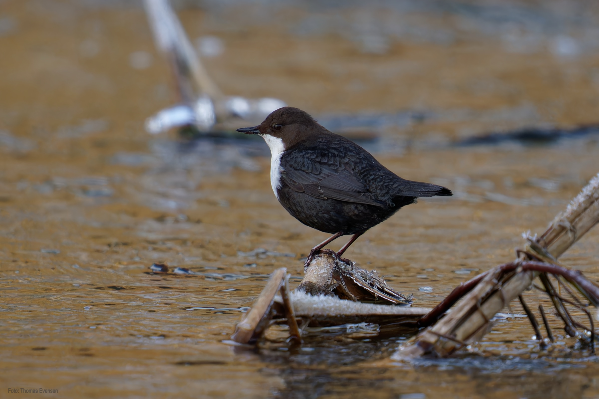
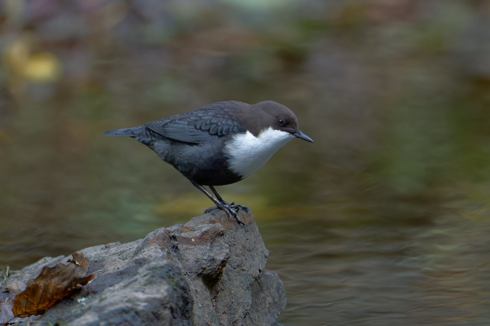
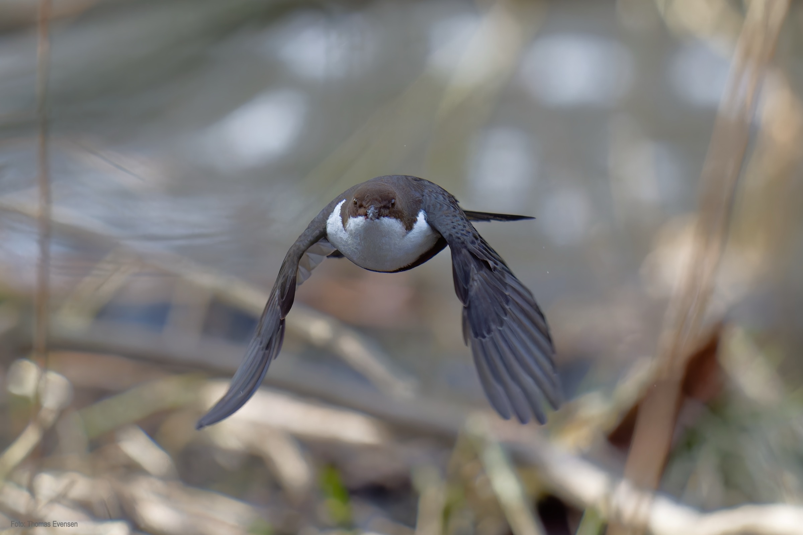
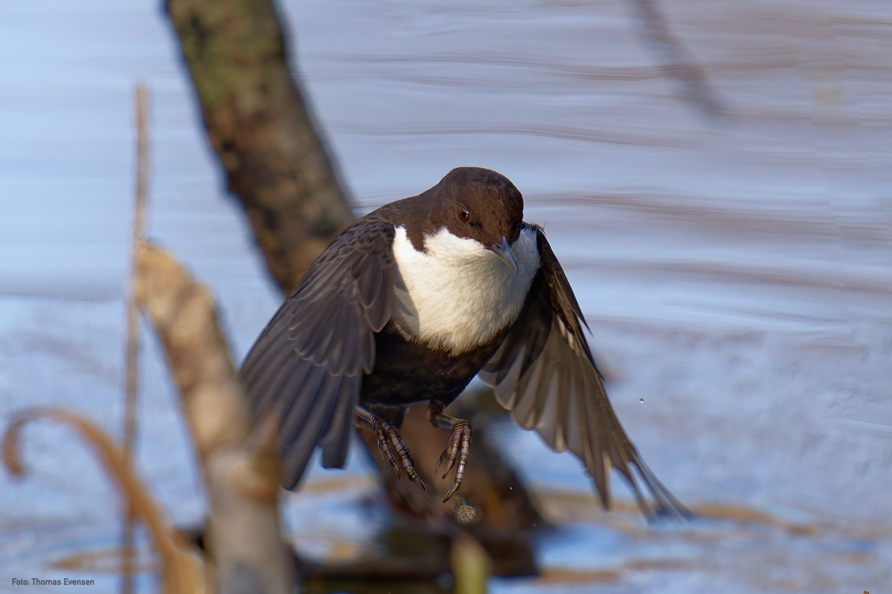

The White-throated dipper is the national bird of Norway. The dipper is photograped close to where I am living. Most likely, they stay in my areae close to sealevel,
during the winter. After winter they move to the mountains for breeding.

| Latin      | UK | Norwegian |
| ----------- | ----------- |   ----------- |
| Cinclus cinclus | [White-throated dipper](https://en.wikipedia.org/wiki/White-throated_dipper) |  [Fossekall](https://no.wikipedia.org/wiki/Fossekall) |

