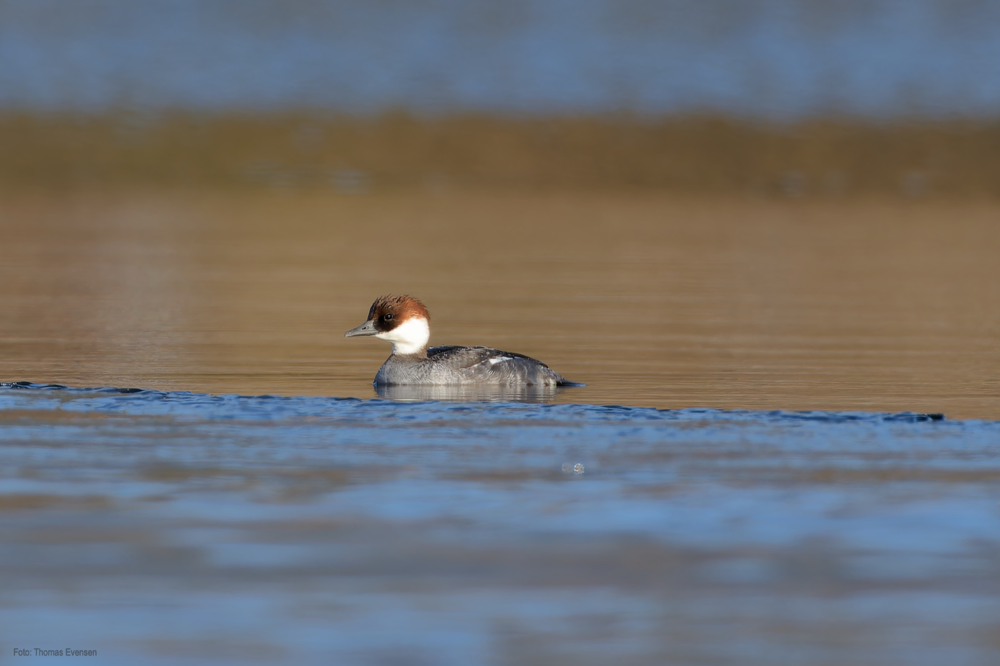
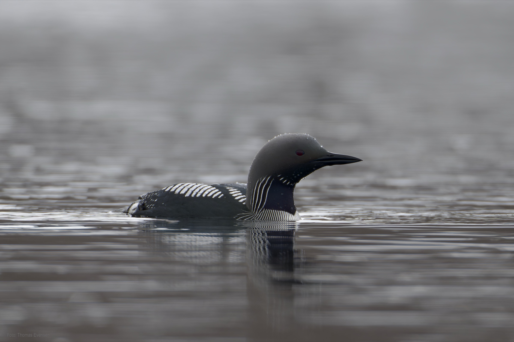
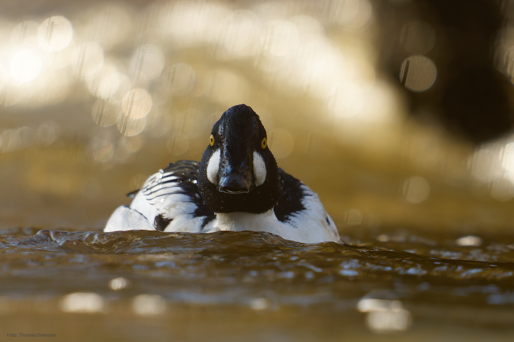
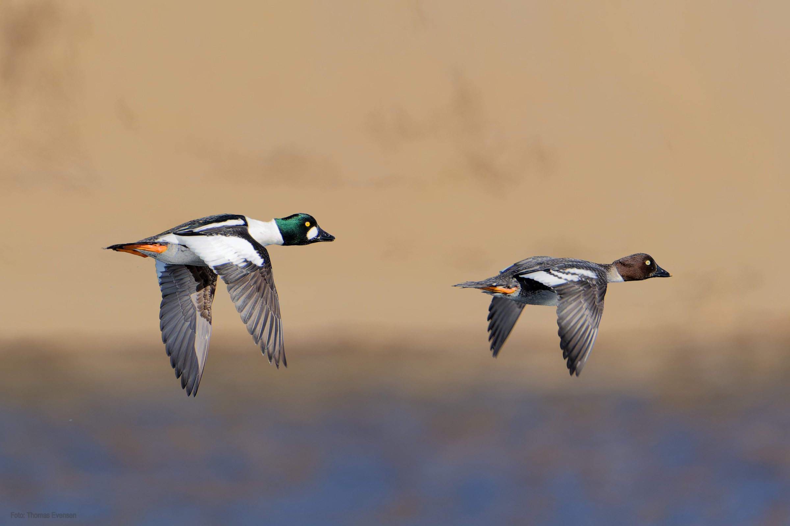
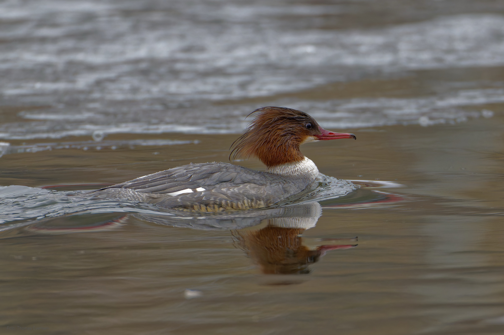
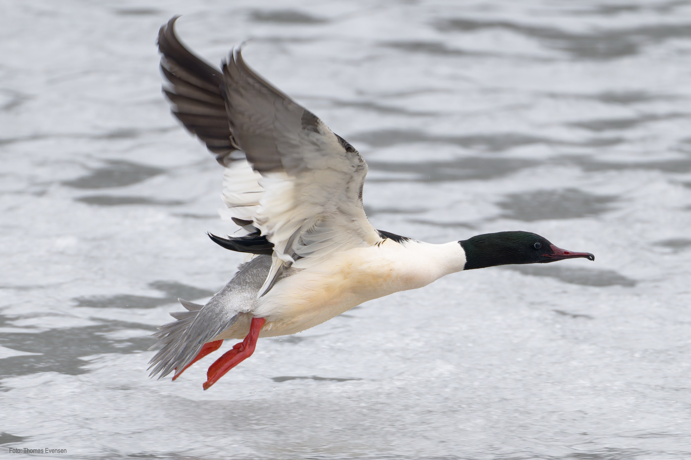
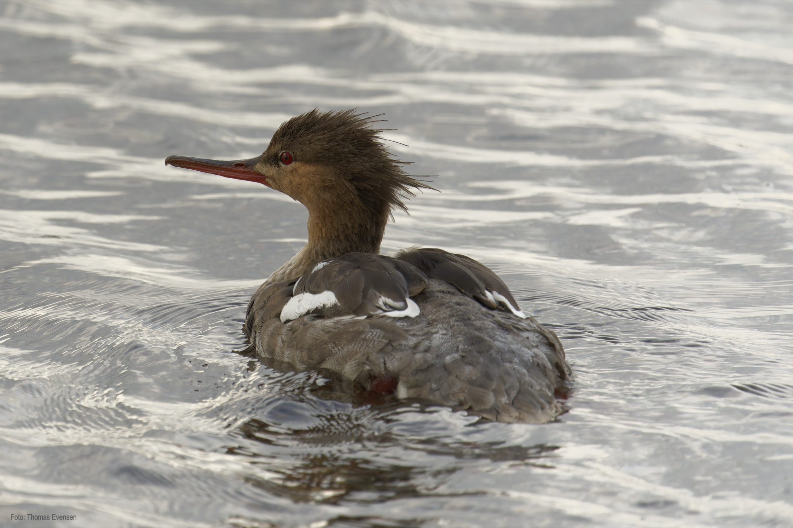

A few diving ducks. The Smew is red listet. The photo of Smew is a female, a beautiful bird.

| Latin      | UK | Norwegian |
| ----------- | ----------- |   ----------- |
| Mergellus albellus  |  [Smew](https://en.wikipedia.org/wiki/Smew) | [Lappfiskand](https://no.wikipedia.org/wiki/Lappfiskand) |
| Gavia arctica  |  [Black-throated loon](https://en.wikipedia.org/wiki/Black-throated_loon) |  [Storlom](https://no.wikipedia.org/wiki/Storlom) |
| Bucephala clangula | [Common goldeneye](https://en.wikipedia.org/wiki/Common_goldeneye) | [Kvinand](https://no.wikipedia.org/wiki/Kvinand) |
| Mergus merganser  | [Common merganser](https://en.wikipedia.org/wiki/Common_merganser) |   [Laksand](https://no.wikipedia.org/wiki/Laksand) |
| Mergus serrator  |  [Red-breasted merganser](https://en.wikipedia.org/wiki/Red-breasted_merganser) |  [Siland](https://no.wikipedia.org/wiki/Siland) |

