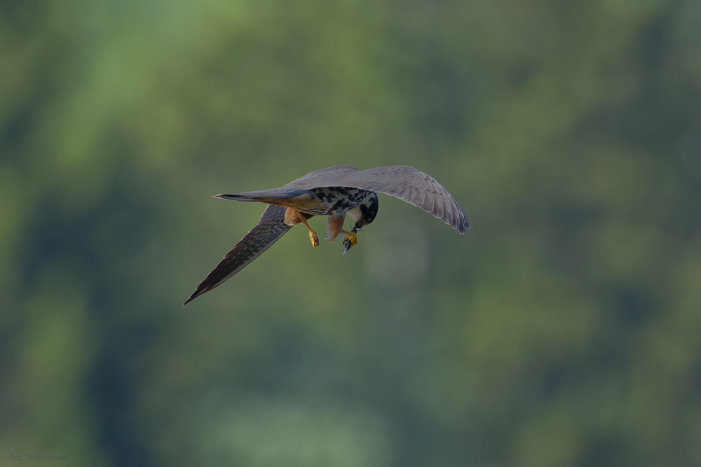
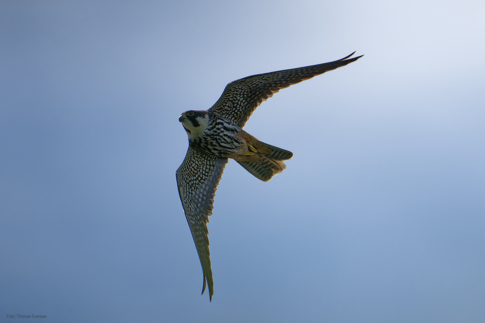
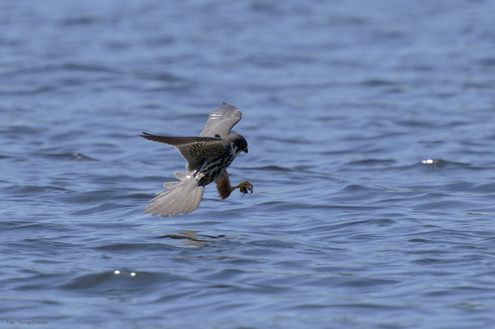
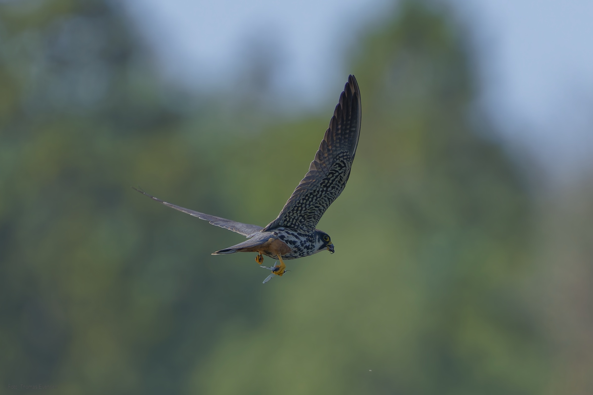
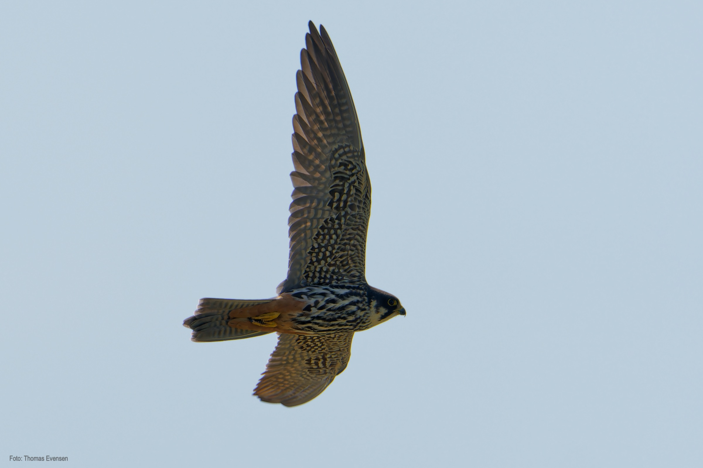

The Eurasian hobby capture and eat dragonflies.

| Latin      | UK | Norwegian |
| ----------- | ----------- |   ----------- |
|  Falco subbuteo |  [Eurasian hobby](https://en.wikipedia.org/wiki/Eurasian_hobby) |  [Lerkefalk](https://no.wikipedia.org/wiki/Lerkefalk) |

