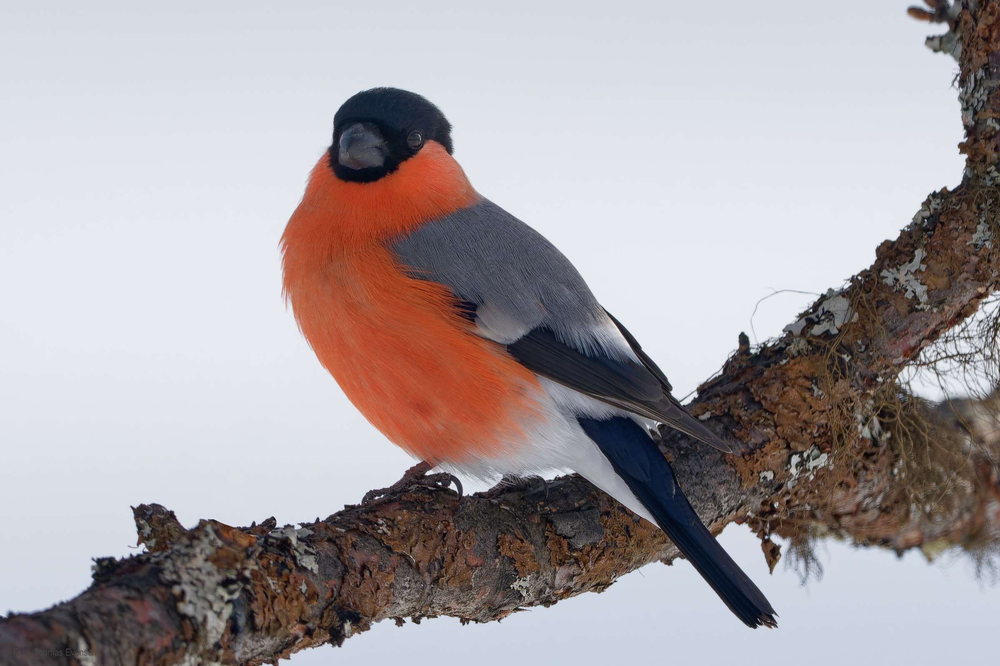
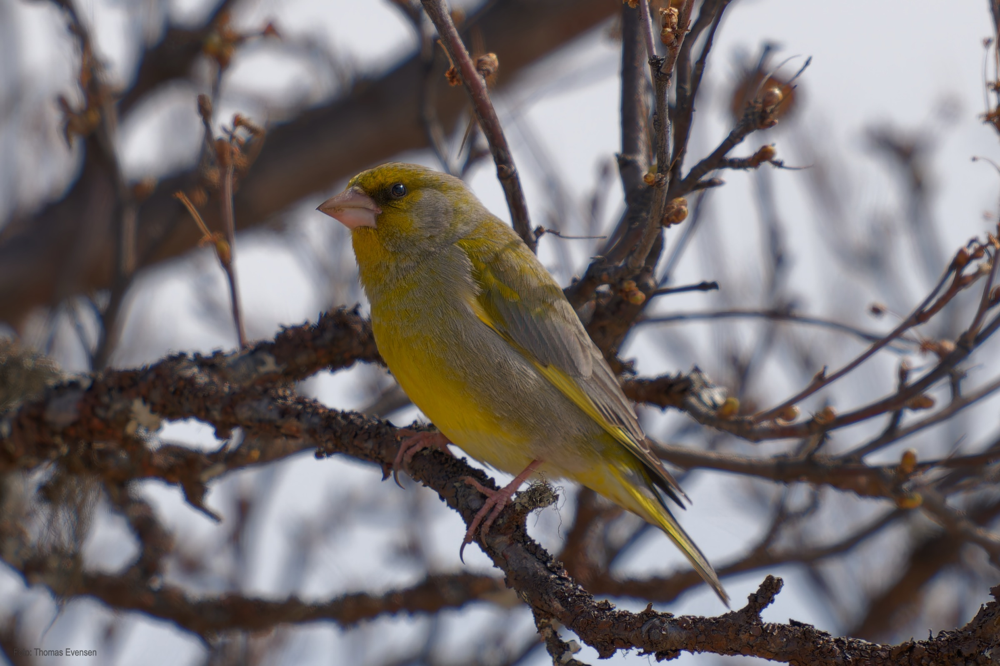
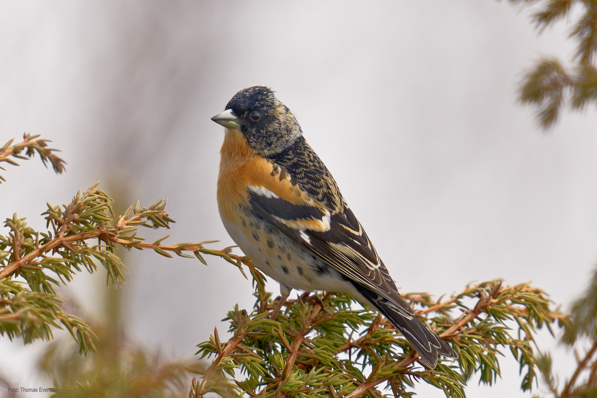

Some finches.

| Latin      | UK | Norwegian |
| ----------- | ----------- |   ----------- |
| Pyrrhula pyrrhula | [Eurasian bullfinch](https://en.wikipedia.org/wiki/Eurasian_bullfinch) |  [Dompap](https://no.wikipedia.org/wiki/Dompap) |
| Fringilla montifringilla | [Brambling](https://en.wikipedia.org/wiki/Brambling) |  [Bjørkefink](https://nn.wikipedia.org/wiki/Bjørkefink)  |
| Chloris chloris | [European greenfinch](https://en.wikipedia.org/wiki/European_greenfinch) |  [Grønnfink](https://no.wikipedia.org/wiki/Grønnfink) |

