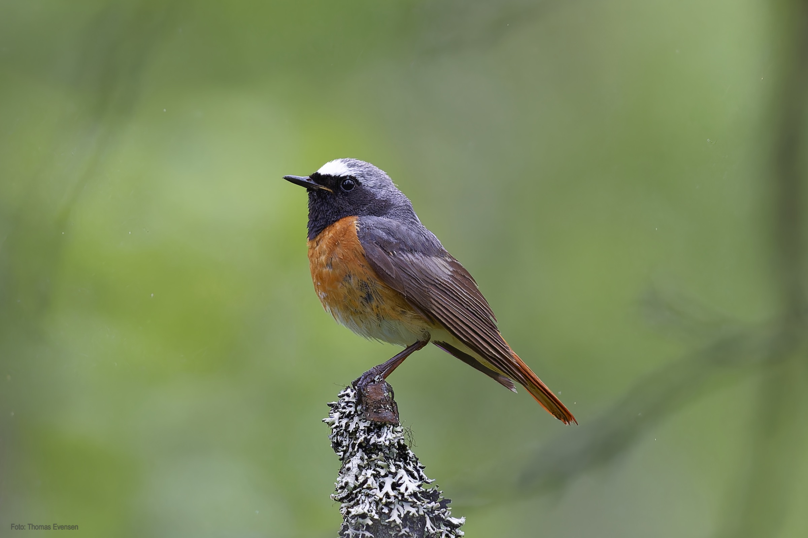
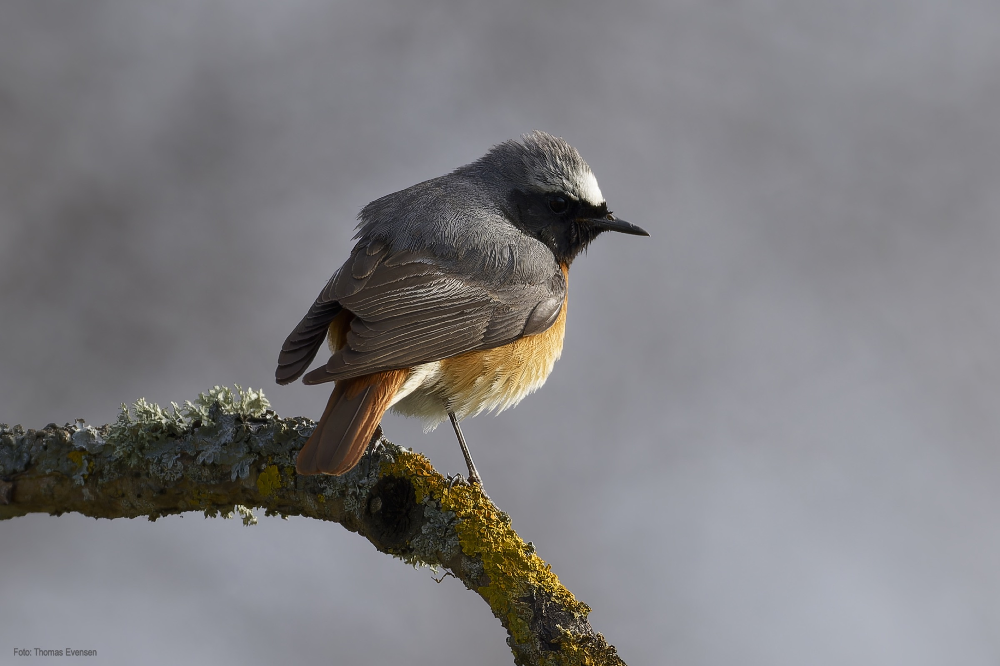
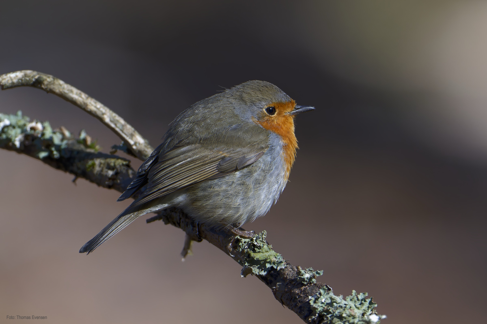
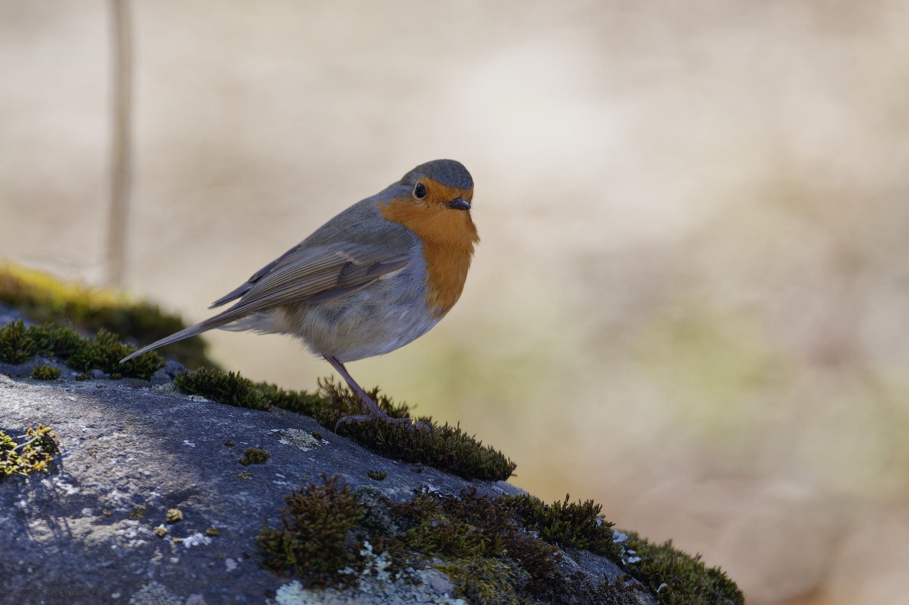
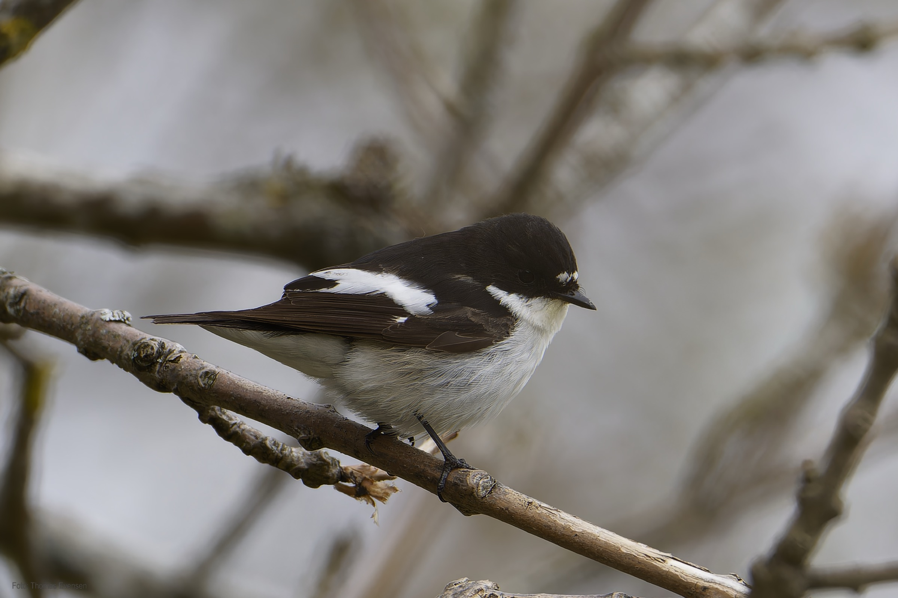
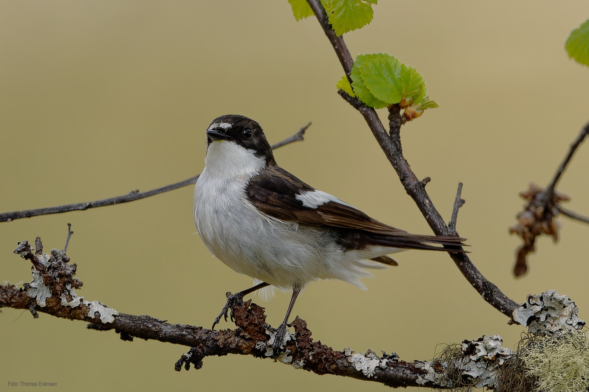
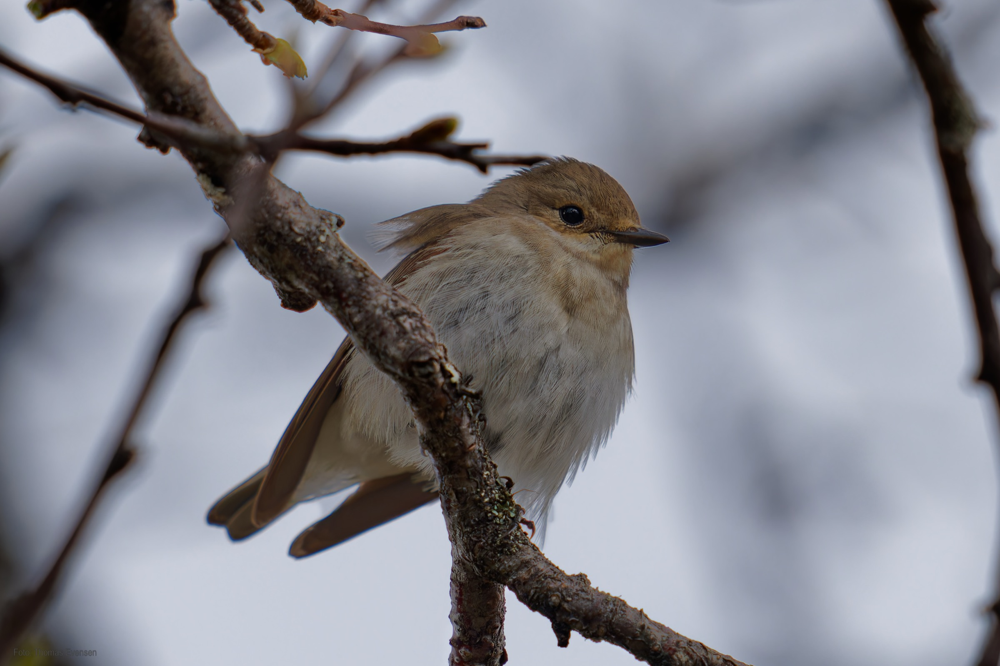
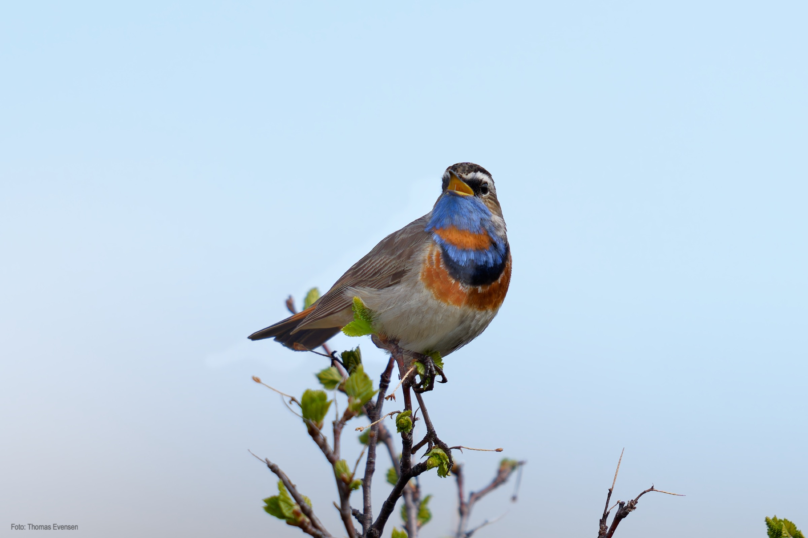
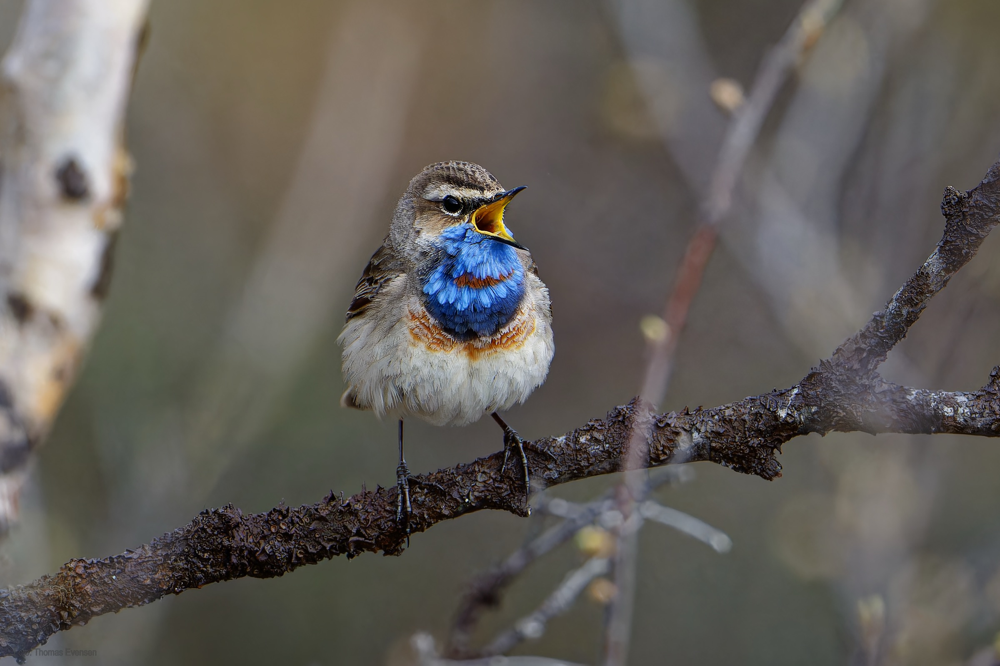

The Common redstart is, in my opinion, one the most beautiful small birds in Norway.

| Latin      | UK | Norwegian |
| ----------- | ----------- |   ----------- |
| Phoenicurus phoenicurus | [Common redstart](https://en.wikipedia.org/wiki/Common_redstart) |  [Rødstjert](https://no.wikipedia.org/wiki/Rødstjert) |
| Ficedula hypoleuca | [European pied flycatcher](https://en.wikipedia.org/wiki/European_pied_flycatcher) |  [Svarthvit fluesnapper](https://no.wikipedia.org/wiki/Svarthvit_fluesnapper) |
| Erithacus rubecula | [European robin](https://en.wikipedia.org/wiki/European_robin) |  [Rødstrupe](https://no.wikipedia.org/wiki/Rødstrupe) |
| Luscinia svecica | [Bluethroat](https://en.wikipedia.org/wiki/Bluethroat) |  [Blåstrupe](https://no.wikipedia.org/wiki/Bl%C3%A5strupe) |

