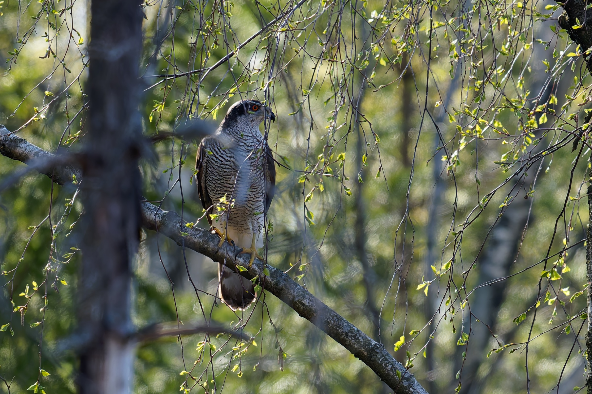
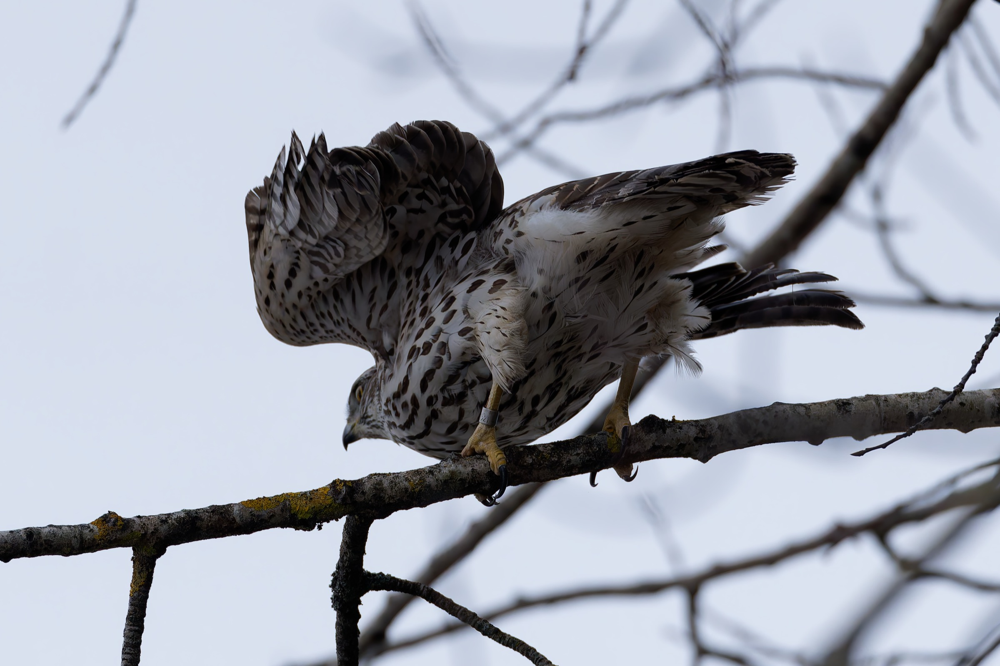
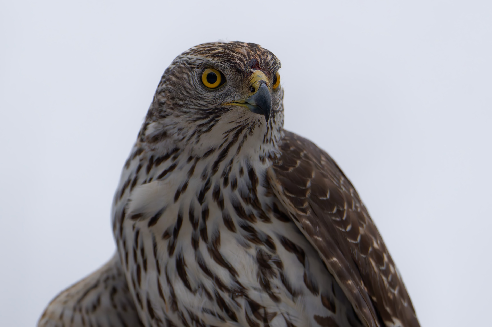

Eurasian goshawk.

# Wikipedia

| Latin      | UK | Norwegian |
| ----------- | ----------- |   ----------- |
| Astur gentilis |  [Eurasian goshawk](https://en.wikipedia.org/wiki/Eurasian_goshawk) | [Hønsehauk](https://no.wikipedia.org/wiki/Hønsehauk) |

# Gallery

