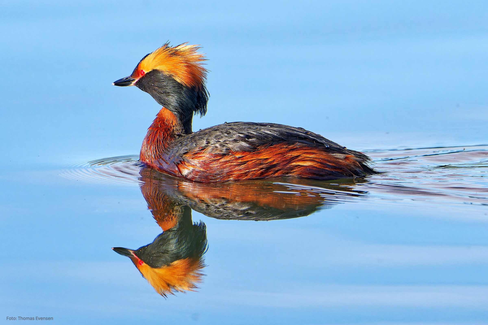
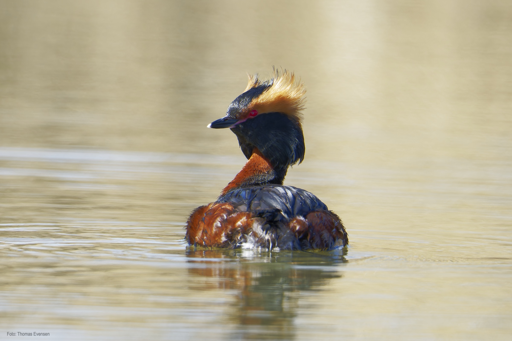
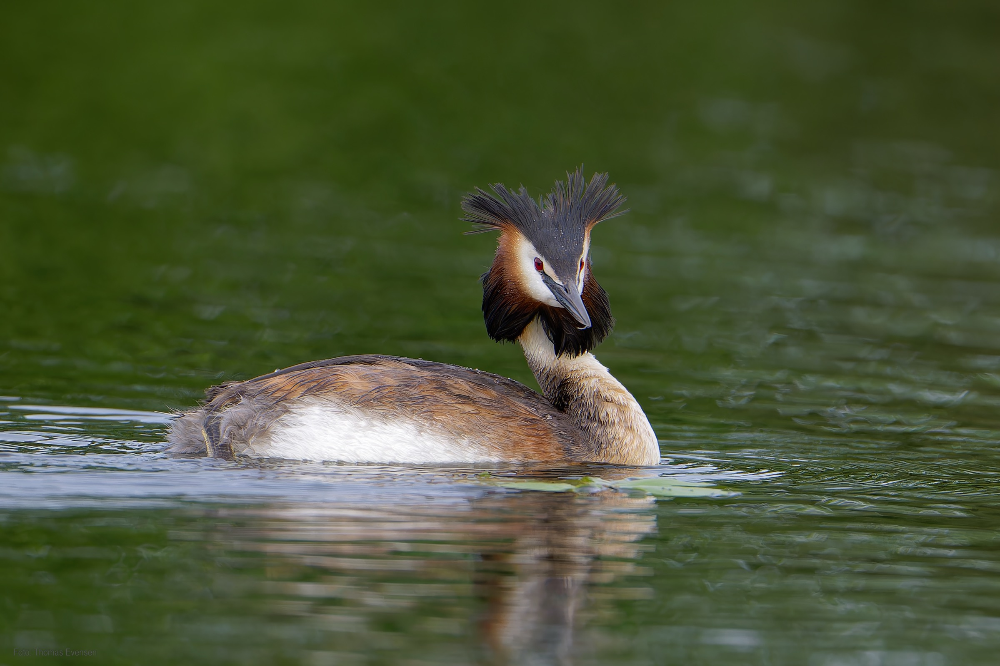
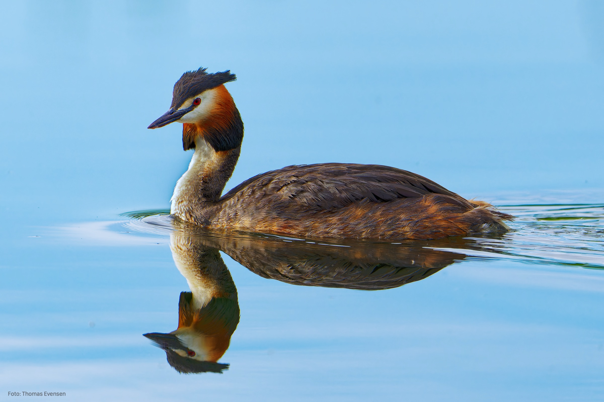
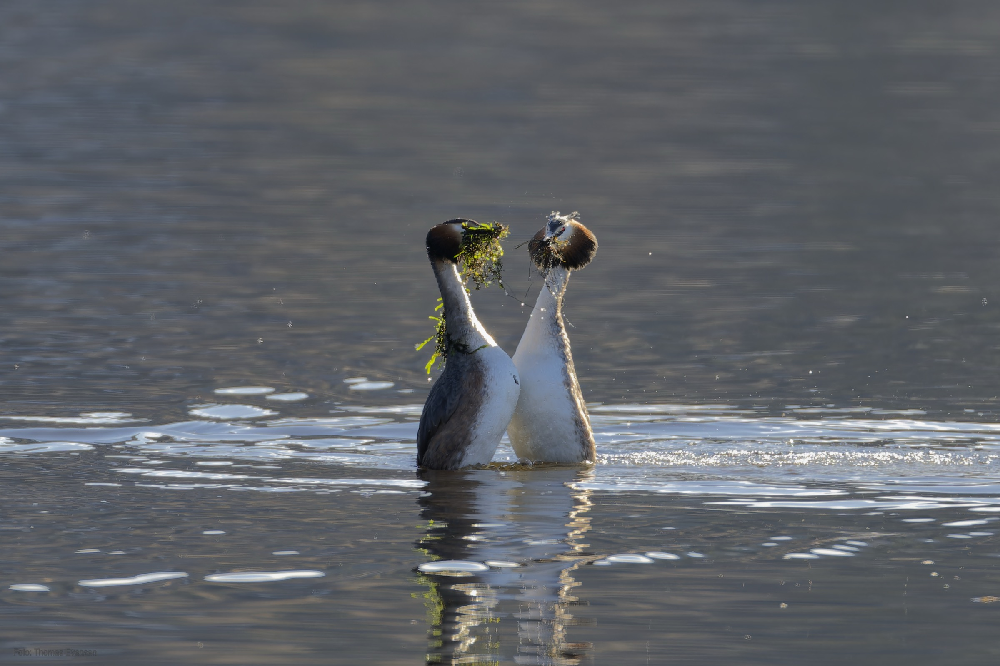

The  Horned Grebe is also a red listet bird. The Horned Grebe is, in my opinion, one of the most beautiful birds in Norway.

| Latin      | UK | Norwegian |
| ----------- | ----------- |   ----------- |
| Podiceps cristatus  | [Great crested grebe](https://en.wikipedia.org/wiki/Great_crested_grebe) | [Toppdykker](https://no.wikipedia.org/wiki/Toppdykker) |
| Podiceps auritus  | [Horned grebe](https://en.wikipedia.org/wiki/Horned_grebe) | [Horndykker](https://no.wikipedia.org/wiki/Horndykker) |

