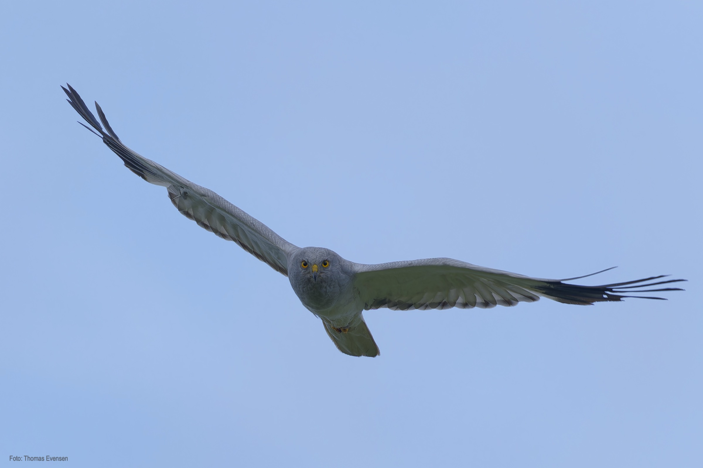
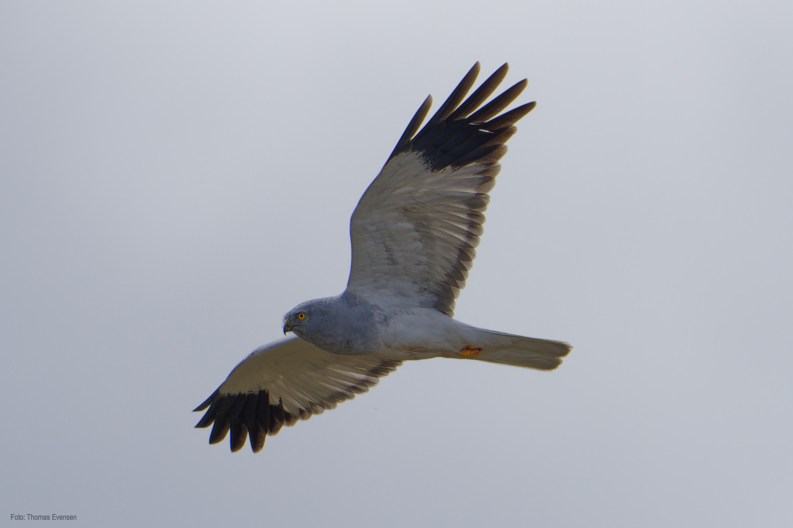
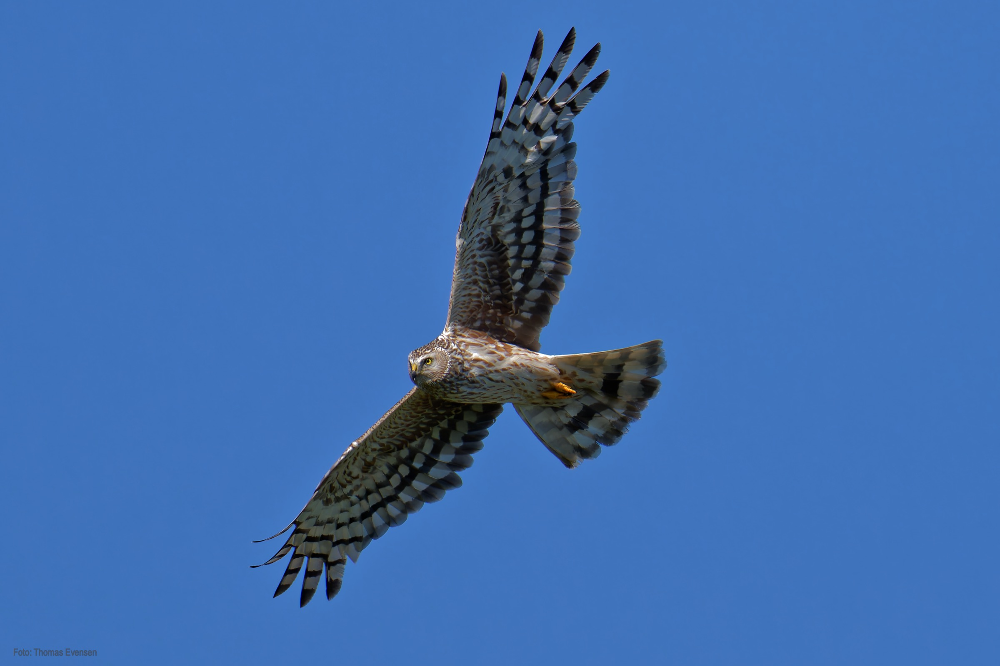
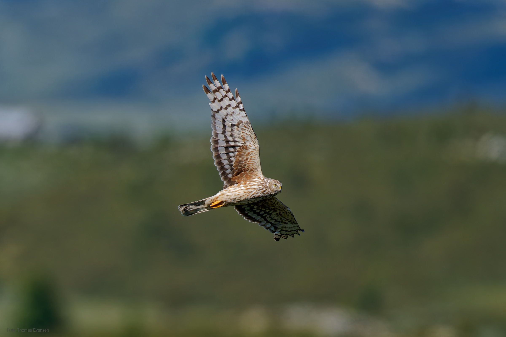
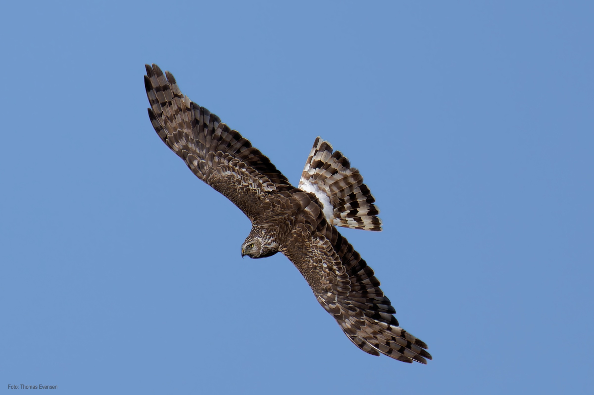
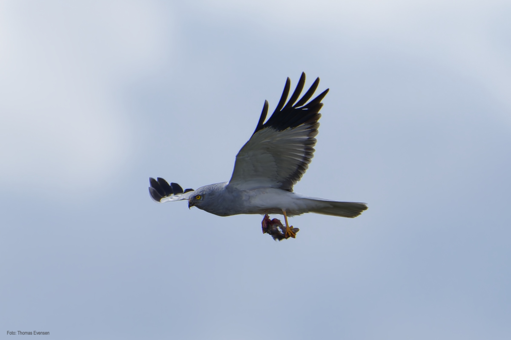
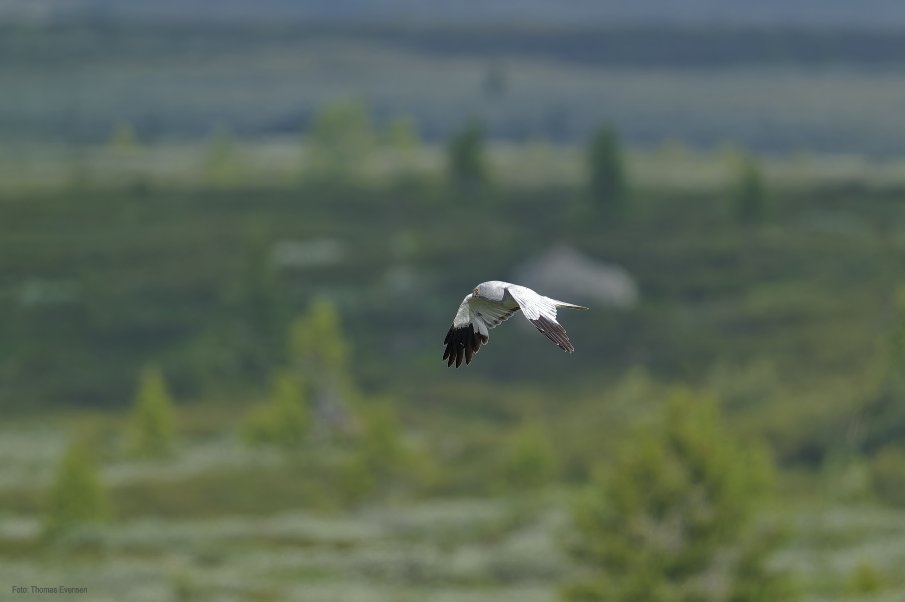
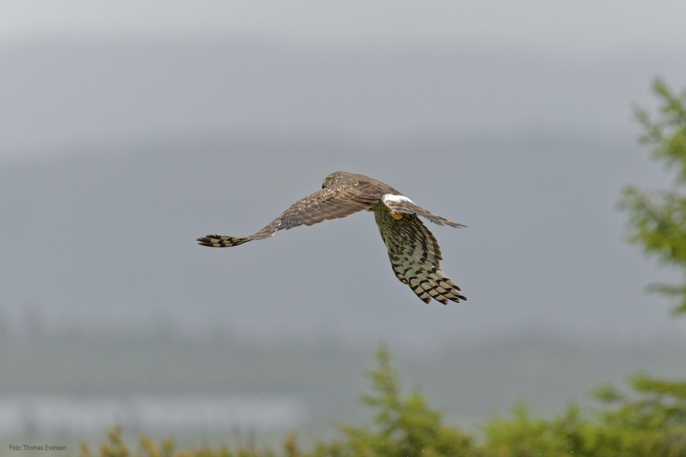

Hen Harrier, male and female. The male is grey and white with black wingtips. There is a Hen Harrier couple nesting close to my cabin in the mountains.
In late May 2024, I observed the female building a nest. And about mid-June 2024 I observed the male returning with prey delivering it to the female.

In July 2024 I was joining a licensed bird bander for banding the young ones. We checked the nest in the first week of July and there was one chick and three eggs.
The chick was at that time too small to get a band and we decided to return for banding one week later. The second week of July 2024 we approached the nest again for banding.
But very sadly a predator, most likely a fox, has attacked the nest. This is how nature is, brutal. I also observed the male Hen Harrier returning with chicks that he had caught
for eating and delivering to the female.

The Hen Harrier is critically endangered in Norway. According to official numbers, there are only about a hundred couples in Norway.

| Latin      | UK | Norwegian |
| ----------- | ----------- |   ----------- |
|  Circus cyaneus |  [Hen harrier](https://en.wikipedia.org/wiki/Hen_harrier) |  [Myrhauk](https://no.wikipedia.org/wiki/Myrhauk) |

