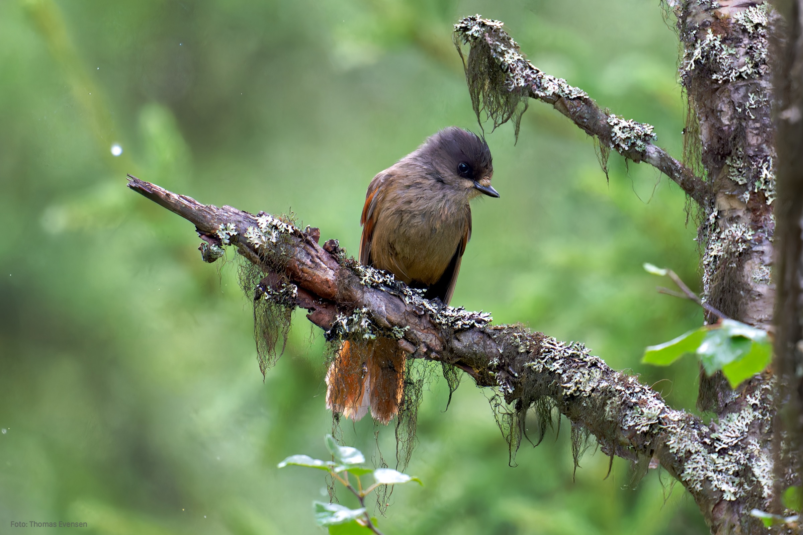
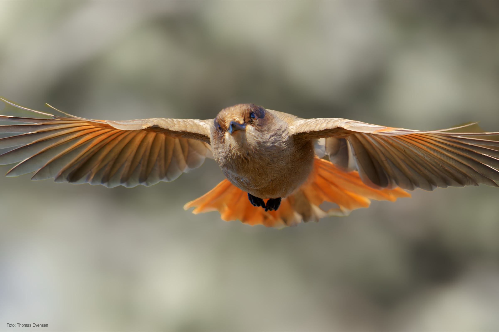
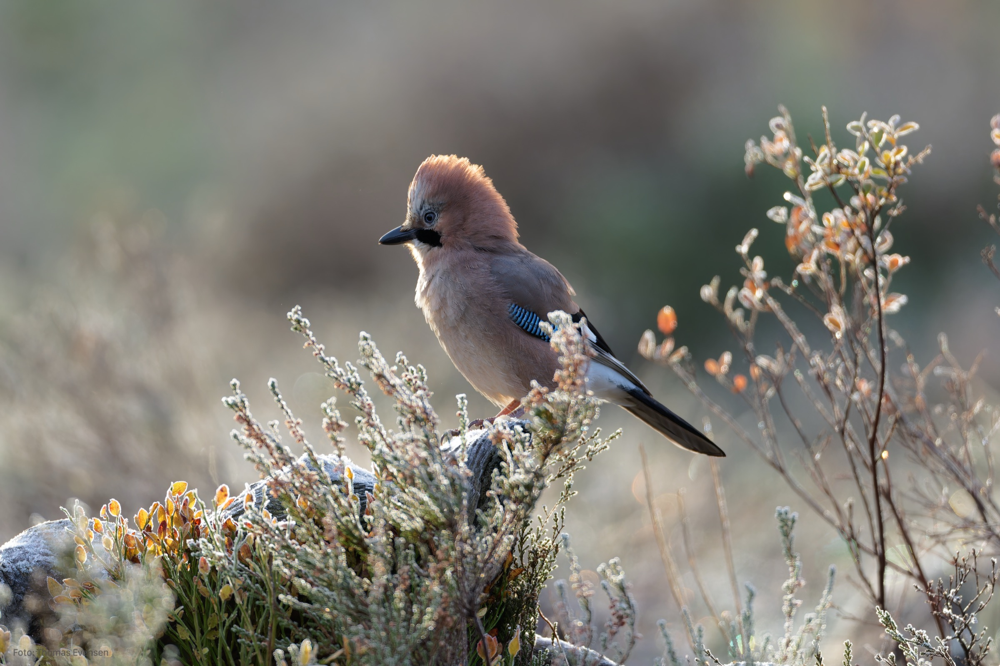
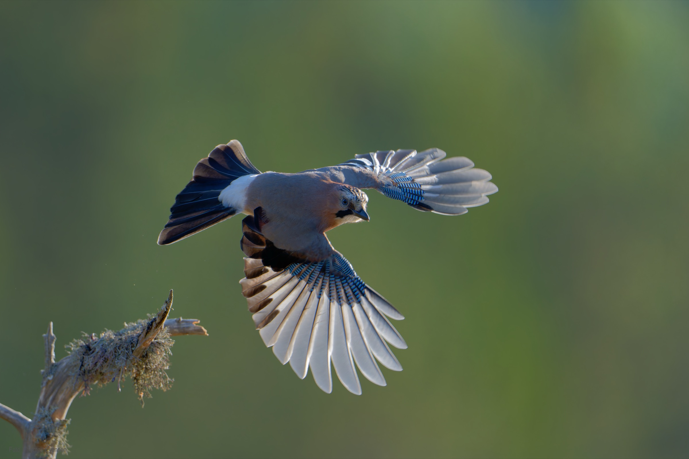
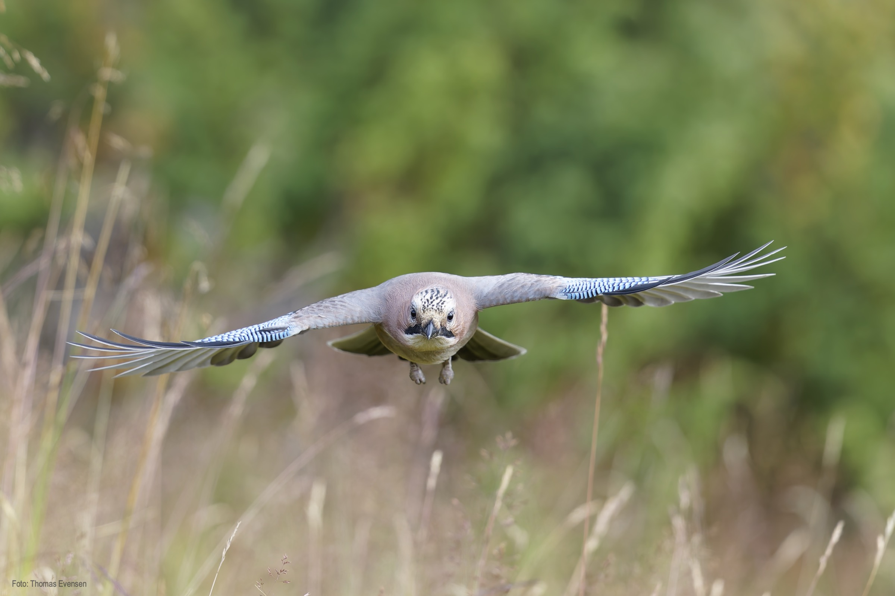

 Some jay birds.

| Latin      | UK | Norwegian |
| ----------- | ----------- |   ----------- |
| Perisoreus infaustus | [Siberian jay](https://en.wikipedia.org/wiki/Siberian_jay) |  [Lavskrike](https://no.wikipedia.org/wiki/Lavskrike) |
| Luscinia svecica | [Eurasian jay](https://en.wikipedia.org/wiki/Eurasian_jay) |  [Nøtteskrike](https://no.wikipedia.org/wiki/Nøtteskrike) |

