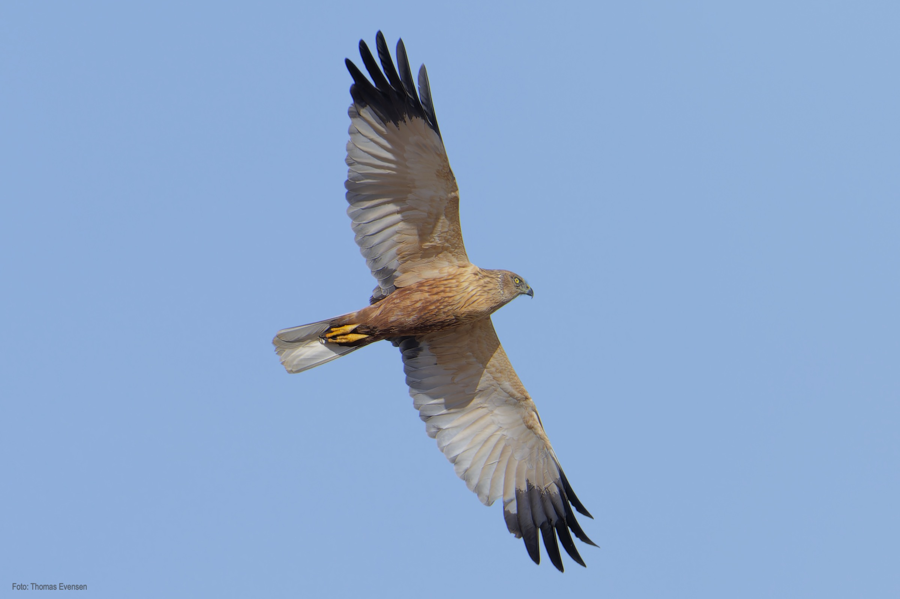
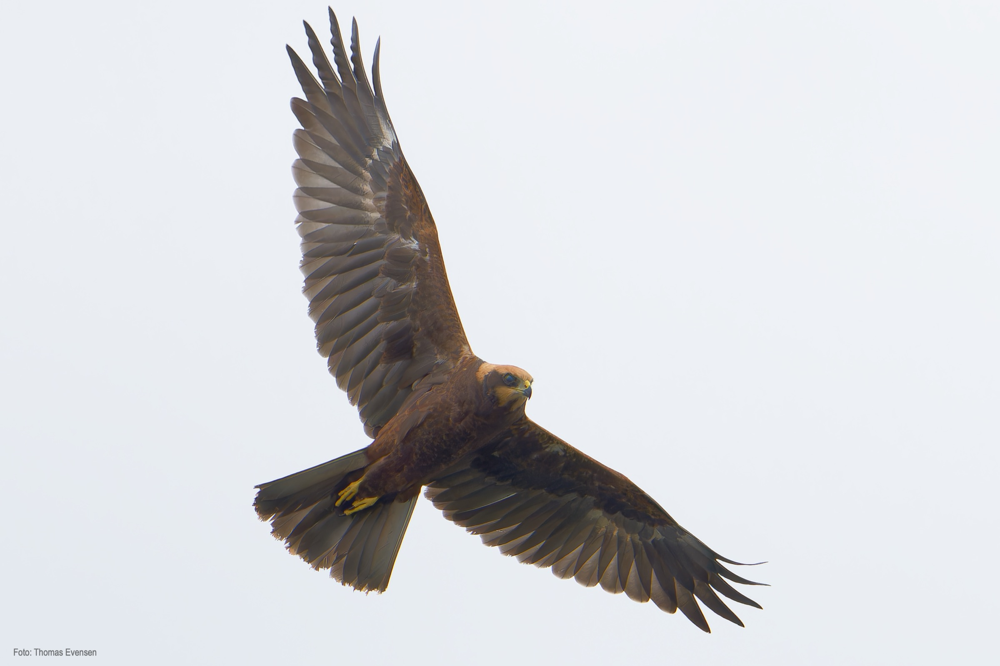
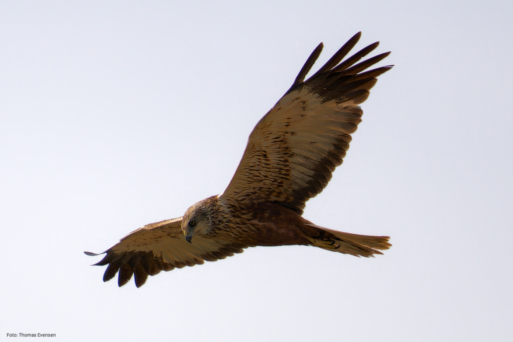
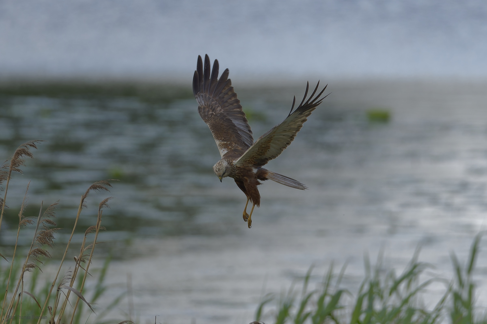
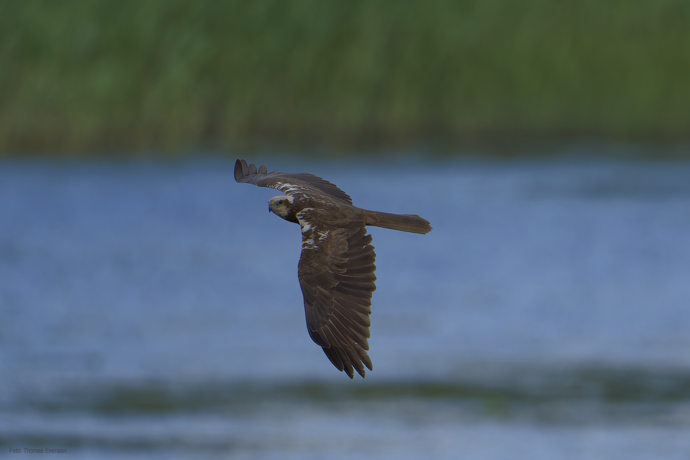

Western marsh harrier.

| Latin      | UK | Norwegian |
| ----------- | ----------- |   ----------- |
|  Circus aeruginosus |  [Western marsh harrier](https://en.wikipedia.org/wiki/Western_marsh_harrier) |  [Sivhauk](https://no.wikipedia.org/wiki/Sivhauk) |

