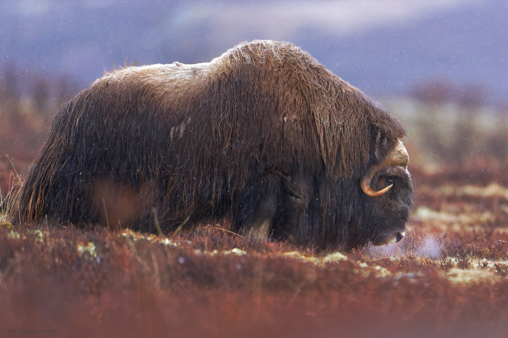
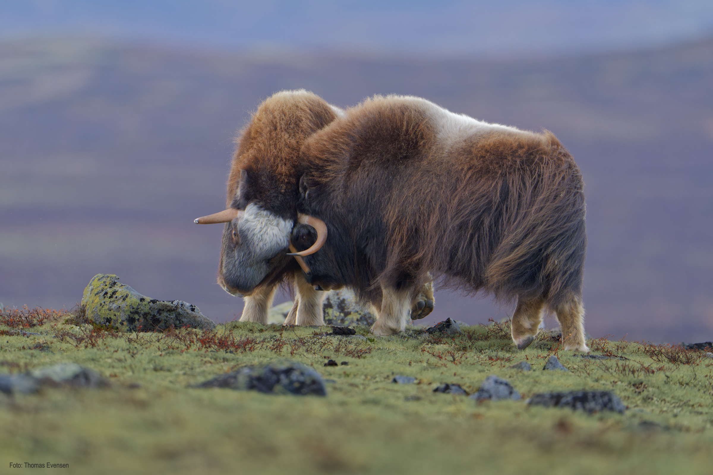
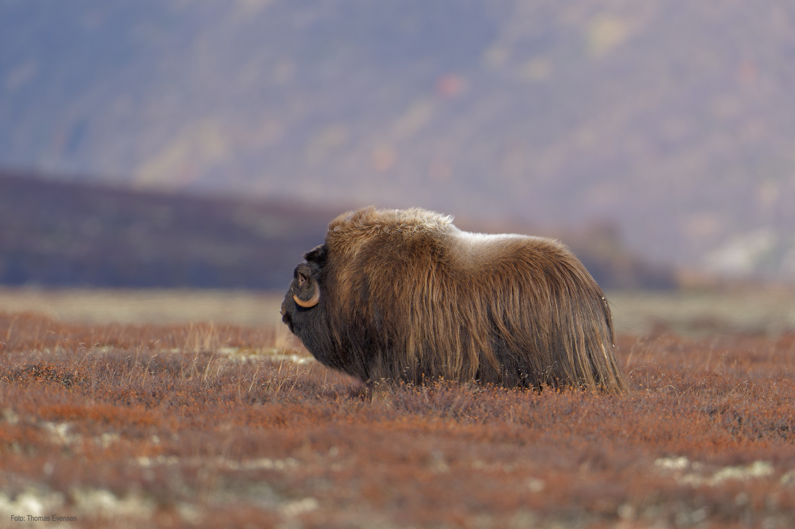
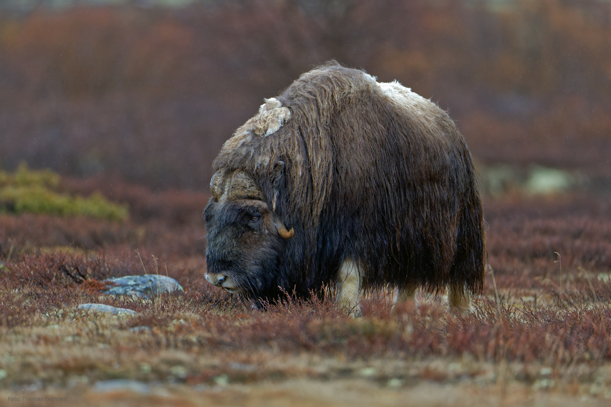
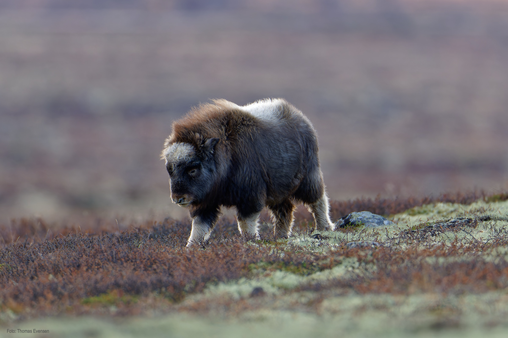
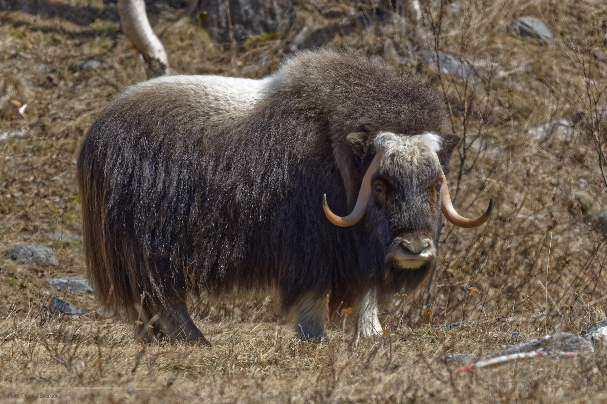

All photos of the muskox were taken in Dovre, Norway, one of the few places in the world where they live.

All but two photos of Muskox are of bulls, some young, about 3 years old, and some old bulls. The cub is about 5-6 months old. The last
photo is of a cow. You may see the difference in their horns. Old bull's horns cover most of the forehead. On young bulls, their horns
are not yet grown together. And the horns on cows do not grow together at all.
Walking with a guide to a photo Muskox is advised. The safety distance is 200 m, and if you get too close to the muskox, they might charge you.

The Muskox is not afraid of anything, they are very quick and you *don´t want* to be charged by it.

## Muskox

|   Latin  | UK | Norwegian |
| ----------- | ----------- |   ----------- |
| Ovibos moschatus | [Muskox](https://en.wikipedia.org/wiki/Muskox) | [Moskusfe](https://no.wikipedia.org/wiki/Moskusfe) |

