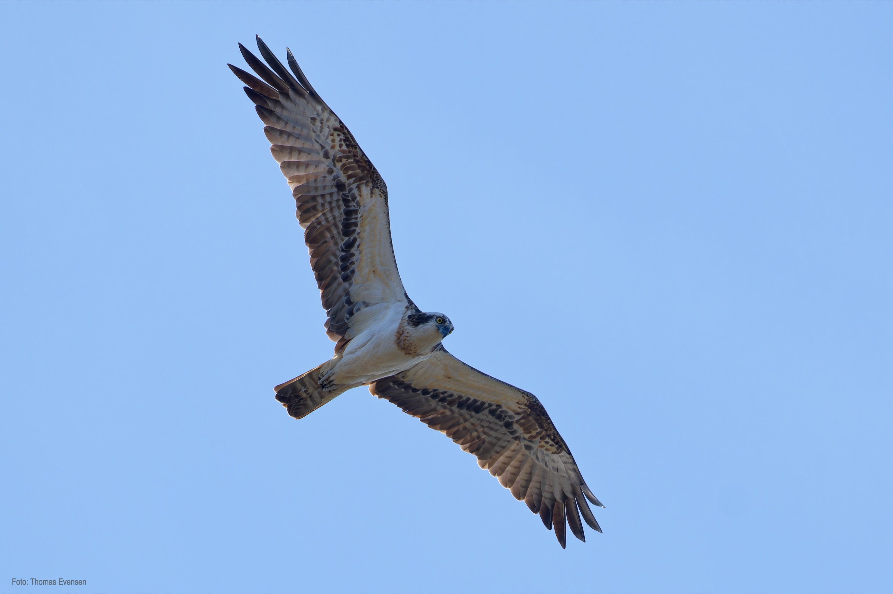
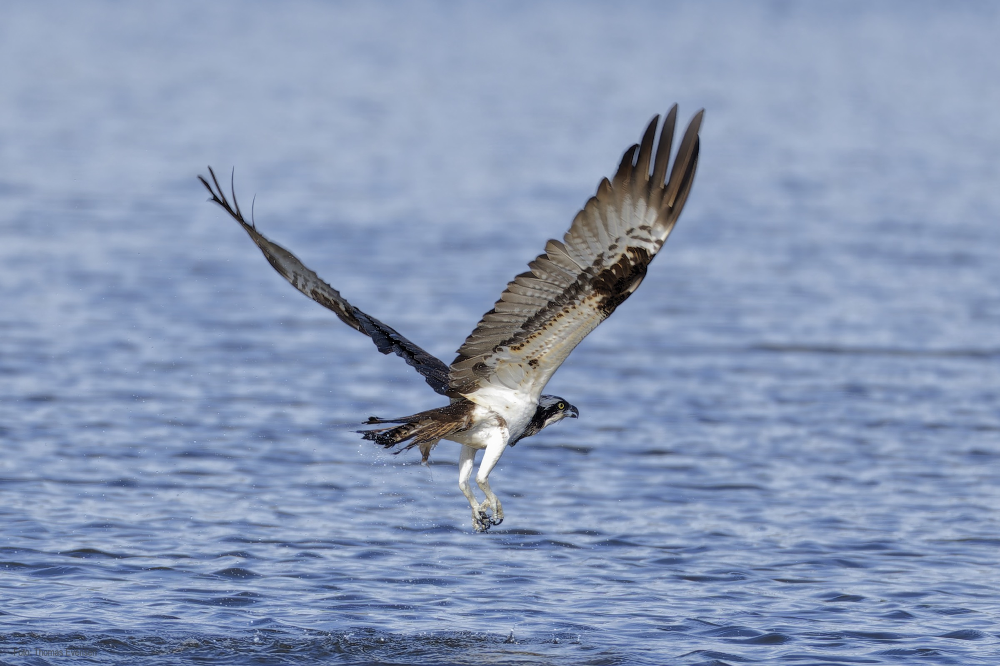
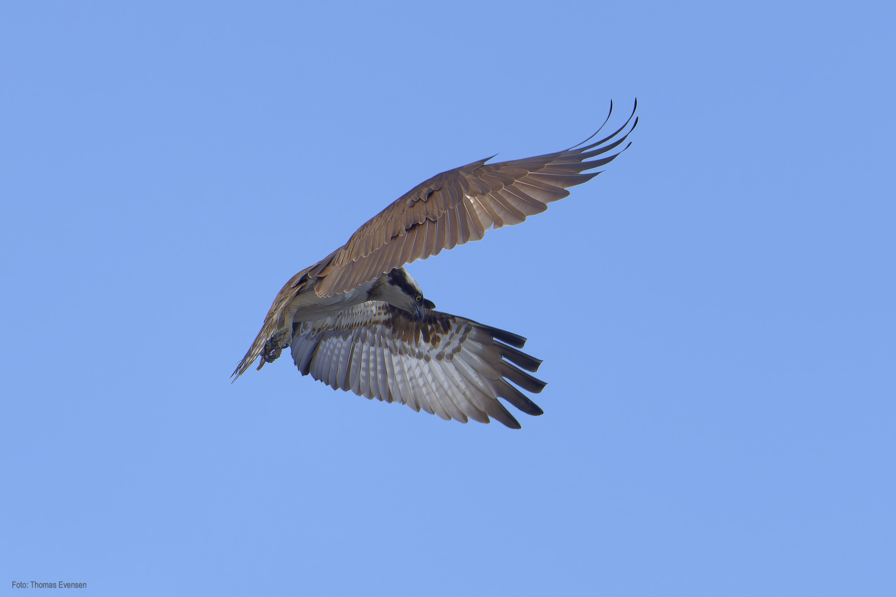
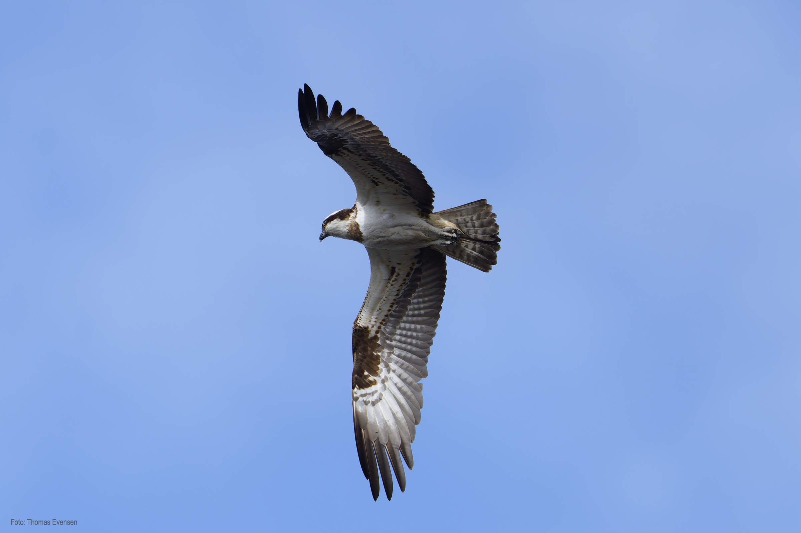

The ospreys are nesting in Norway from April to September, and some of them close to where I live.

# Wikipedia

| Latin      | UK | Norwegian |
| ----------- | ----------- |   ----------- |
| Pandion haliaetus |  [Osprey](https://en.wikipedia.org/wiki/Osprey) | [Fiskeørn](https://no.wikipedia.org/wiki/Fiske%C3%B8rn) |

# Gallery

