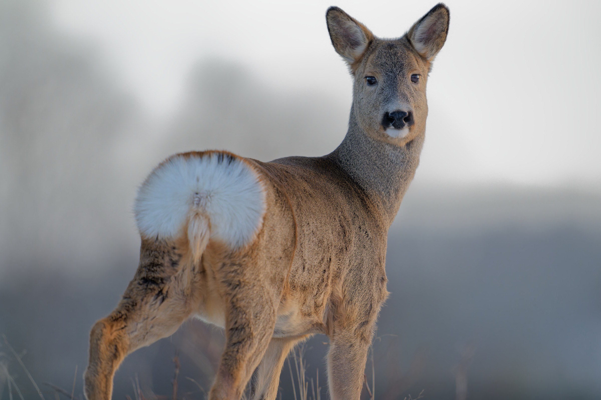
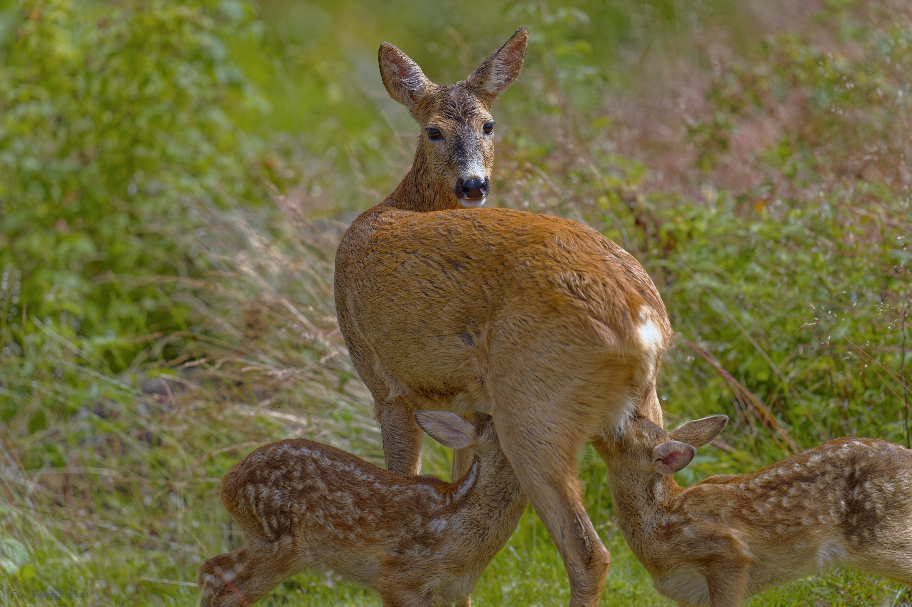
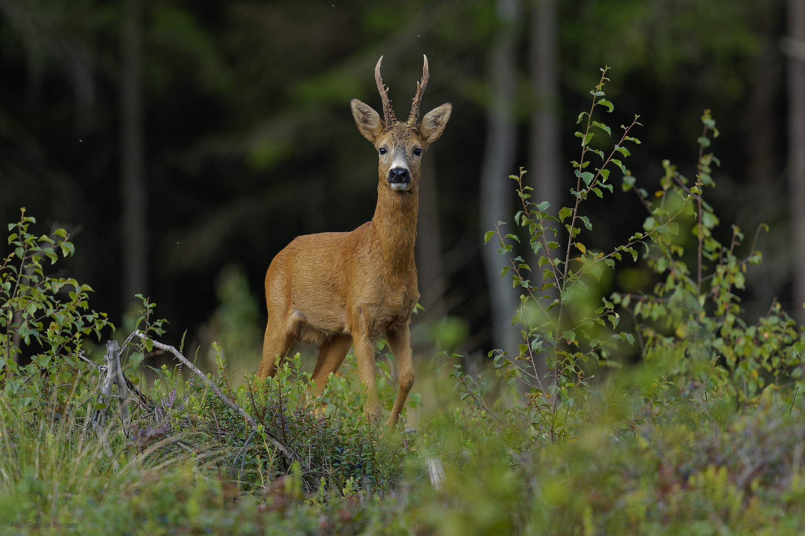
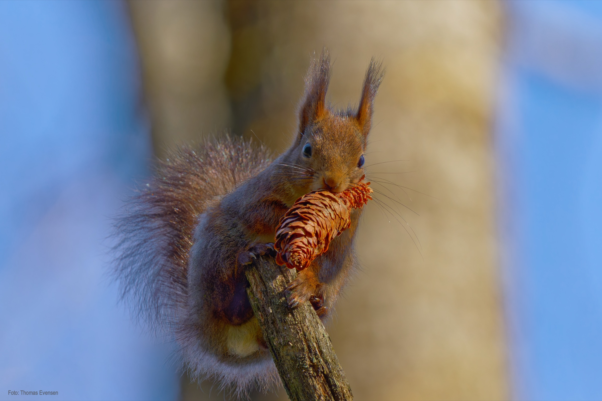
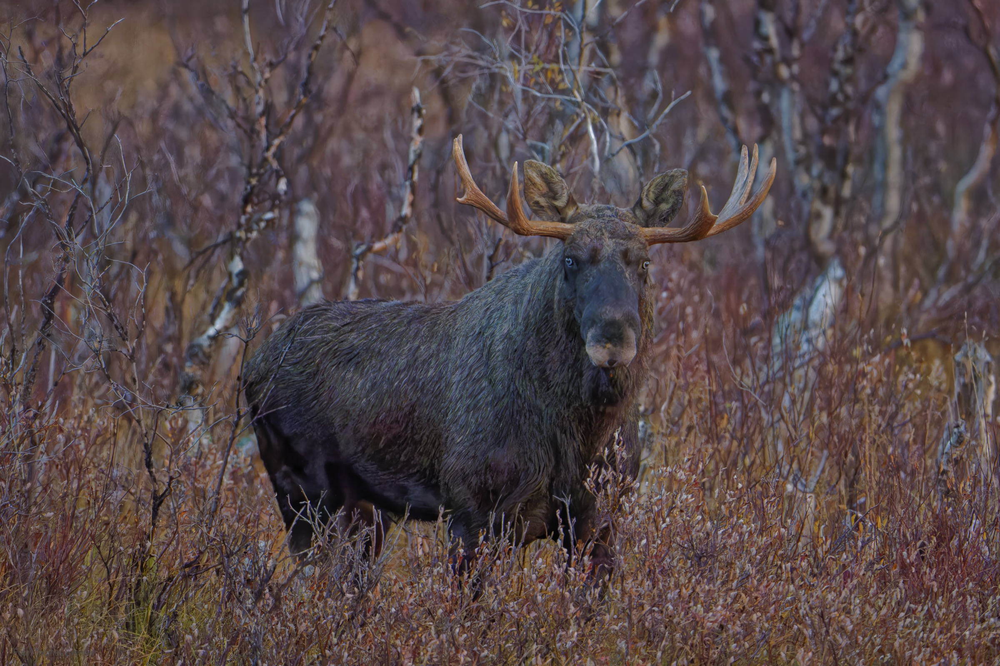
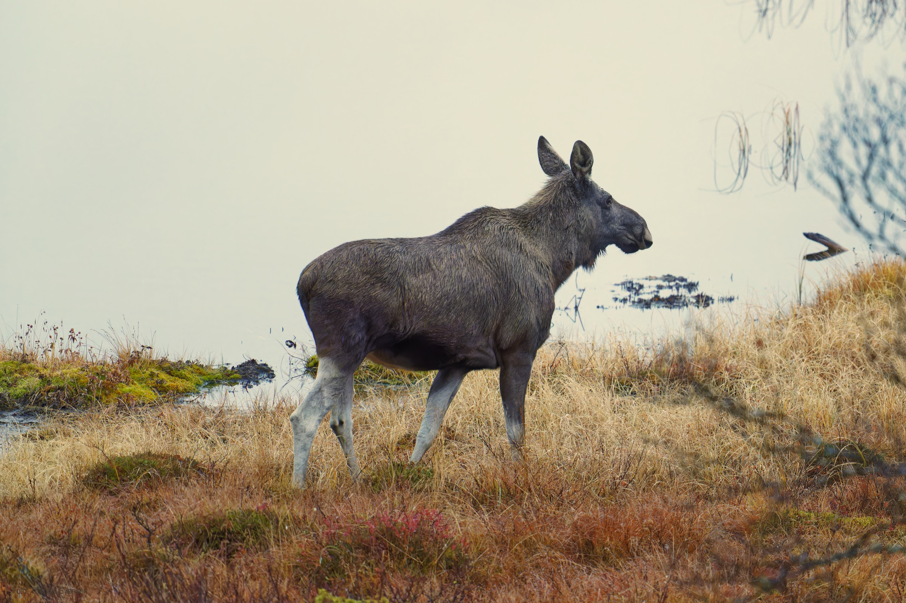
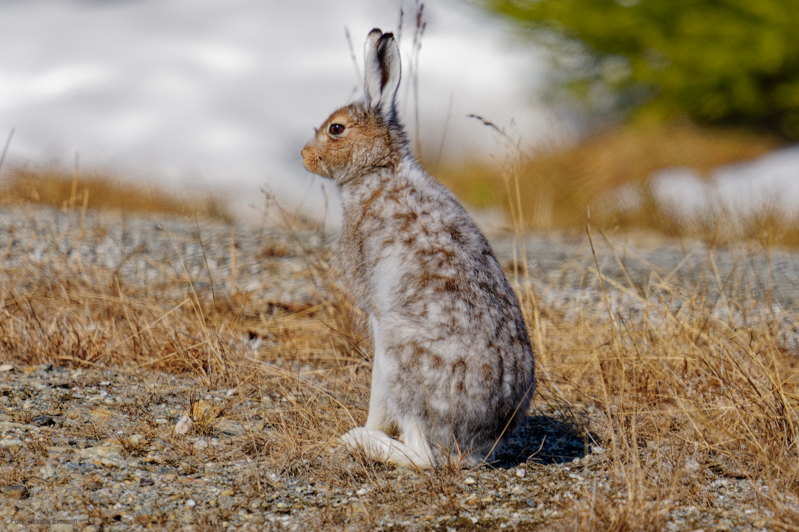
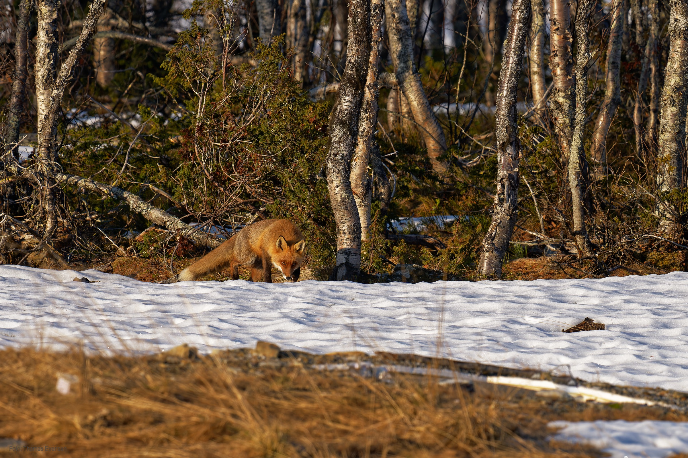
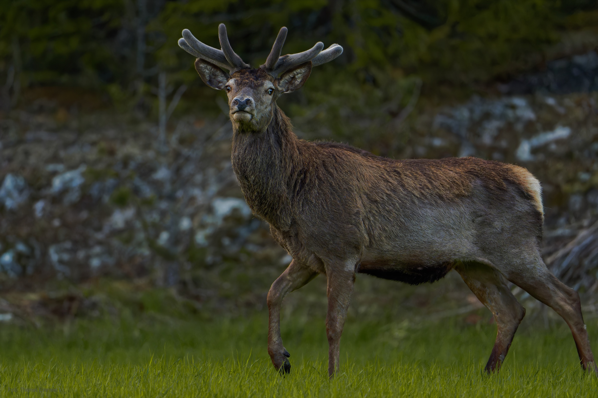

Moose, Mountain hare,  Roe deer with cubs, Red deer, Red fox, Red squirrel.

## Animals

| Latin     | UK | Norwegian |
| ----------- | ----------- |   ----------- |
| Alces alces | [Moose](https://en.wikipedia.org/wiki/Moose) | [Elg](https://no.wikipedia.org/wiki/Elg) |
| Lepus timidus | [Mountain hare](https://en.wikipedia.org/wiki/Mountain_hare) | [Hare](https://no.wikipedia.org/wiki/Hare) |
| Capreolus capreolus  | [Roe deer](https://en.wikipedia.org/wiki/Roe_deer) | [Rådyr](https://no.wikipedia.org/wiki/Rådyr) |
| Vulpes vulpes | [Red fox](https://en.wikipedia.org/wiki/Red_fox) |  [Rødrev](https://no.wikipedia.org/wiki/Rødrev) |
| Sciurus vulgaris | [Red squirrel](https://en.wikipedia.org/wiki/Red_squirrel) |  [Ekorn](https://no.wikipedia.org/wiki/Ekorn)|
| Cervus elaphus | [Red deer](https://en.wikipedia.org/wiki/Red_deer) |  [Hjort](https://no.wikipedia.org/wiki/Hjort)|

