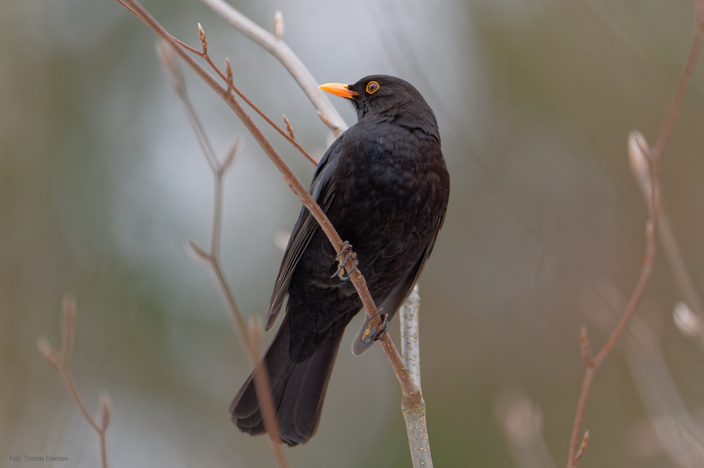
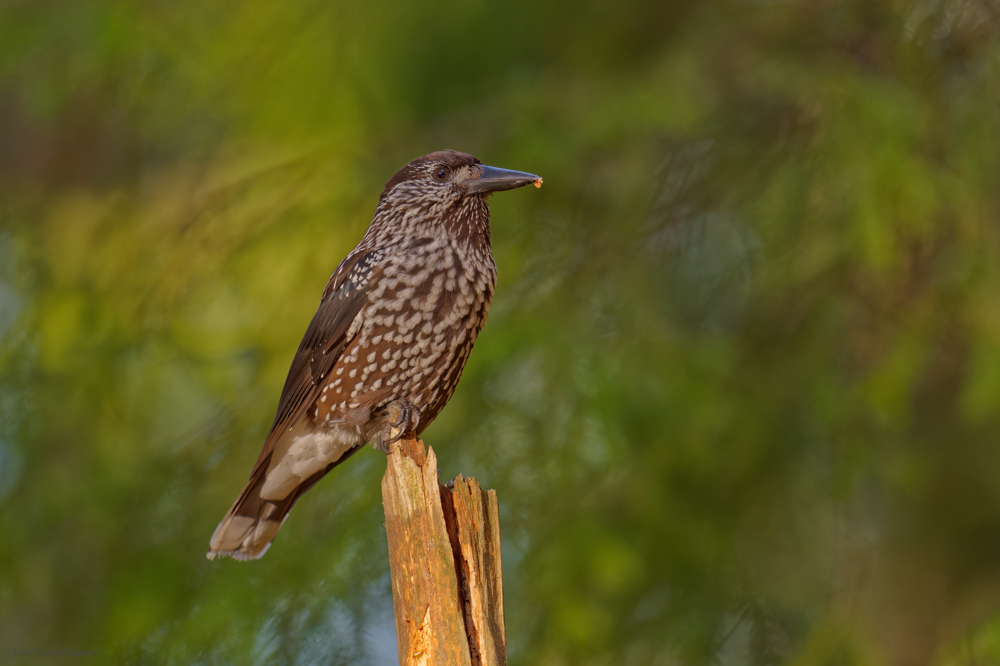
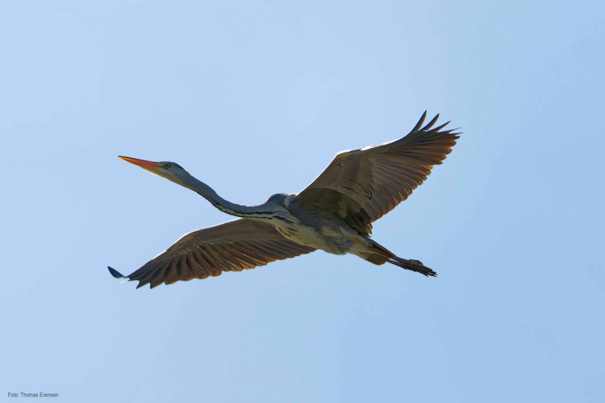
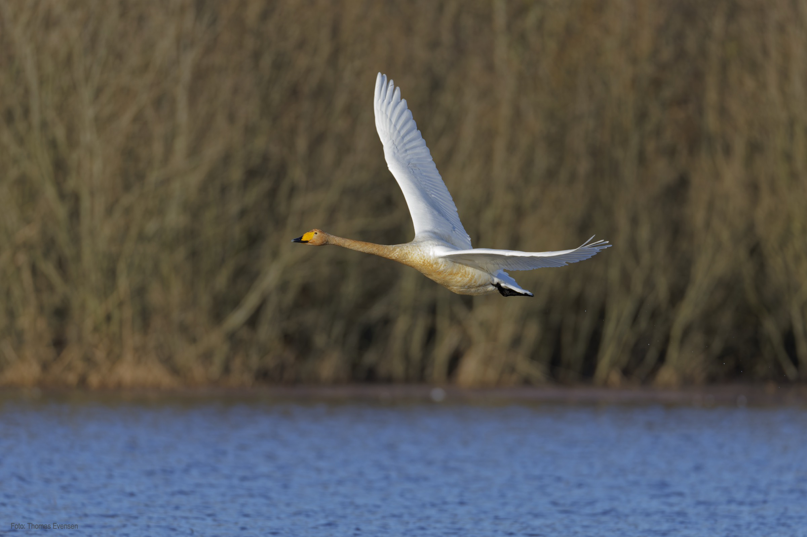

Some other birds.

| Latin      | UK | Norwegian |
| ----------- | ----------- |   ----------- |
|Turdus merula | [Common blackbird](https://en.wikipedia.org/wiki/Common_blackbird) |  [Svarttrost](https://no.wikipedia.org/wiki/Svarttrost) |
| Ardea cinerea | [Grey heron](https://en.wikipedia.org/wiki/Grey_heron) |  [Gråhegre](https://no.wikipedia.org/wiki/Gråhegre) |
| Nucifraga caryocatactes | [Eurasian nutcracker](https://en.wikipedia.org/wiki/Spotted_nutcracker) |  [Nøttekråke](https://no.wikipedia.org/wiki/Nøttekråke) |
| Cygnus cygnus | [Whooper swan](https://en.wikipedia.org/wiki/Whooper_swan) |  [Sangsvane](https://no.wikipedia.org/wiki/Sangsvane) |

