Northern hawk-owl, Short-eared owl, Tawny owl, and Eurasian pygmy owl. The three last owls, I have photographed where I live.
The Northern hawk-owl, a common owl, is photographed in the mountains. Only the Tawny owl of these four owls are hunting by night.
All three others are hunting by daylight.

For the last weeks in late October and the beginning of November 2024, I have observed most likely three different Northern hawk-owls
close to my cabin in the mountains. I don't know if this is normal or quite special. The Northern hawk-owl is easy to spot.
Normally they sit at the highest point of high trees and spots for prey. And they seem somewhat different as well, the owl at one place
has often let me come very close, about 4-5 meters. Others again fly away if I come too close.

| Latin      | UK | Norwegian |
| ----------- | ----------- |   ----------- |
| Surnia ulula  |  [Northern hawk-owl](https://en.wikipedia.org/wiki/Northern_hawk-owl) | [Haukugle](https://no.wikipedia.org/wiki/Haukugle)    |
| Asio flammeus  | [Short-eared owl](https://en.wikipedia.org/wiki/Short-eared_owl) |   [Jordugle](https://no.wikipedia.org/wiki/Jordugle)    |
| Strix aluco  | [Tawny owl](https://en.wikipedia.org/wiki/Tawny_owl) |   [Kattugle](https://no.wikipedia.org/wiki/Kattugle)     |
| Glaucidium passerinum  |  [Eurasian pygmy owl](https://en.wikipedia.org/wiki/Eurasian_pygmy_owl) | [Spurveugle](https://no.wikipedia.org/wiki/Spurveugle)    |

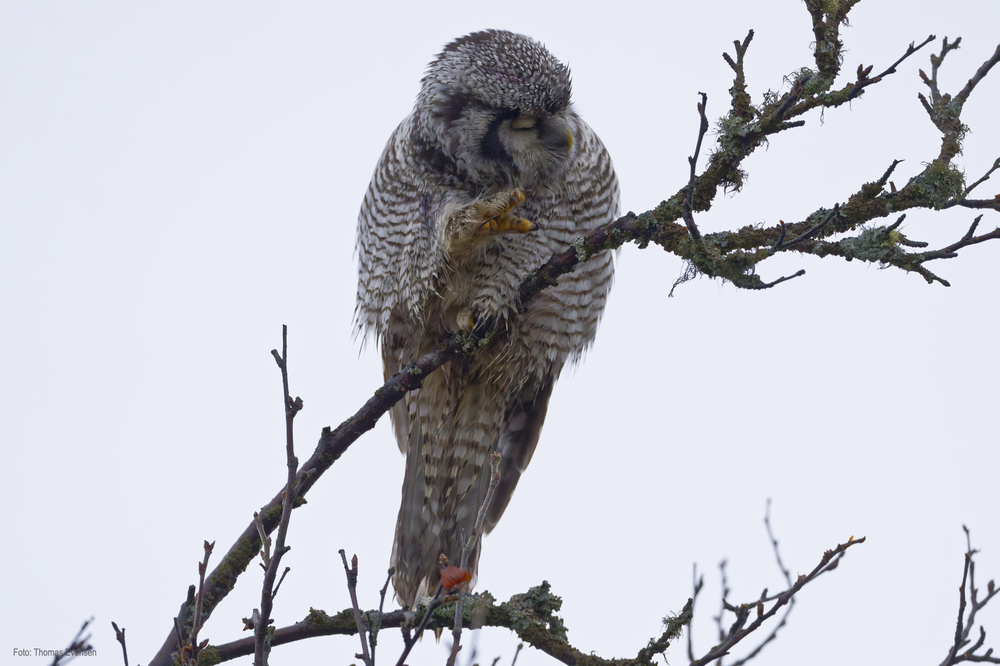
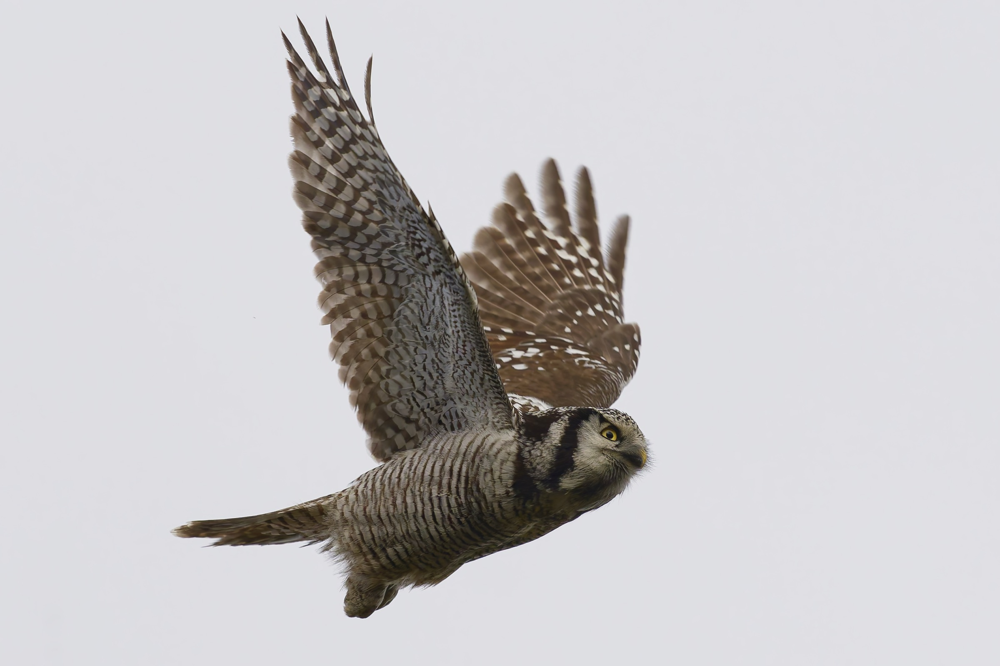
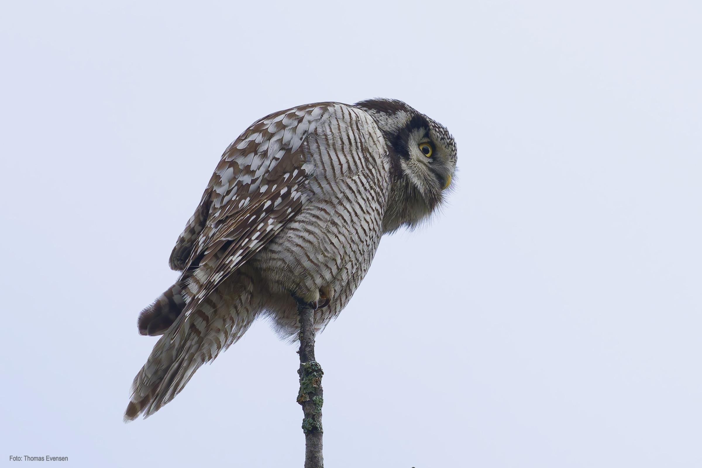
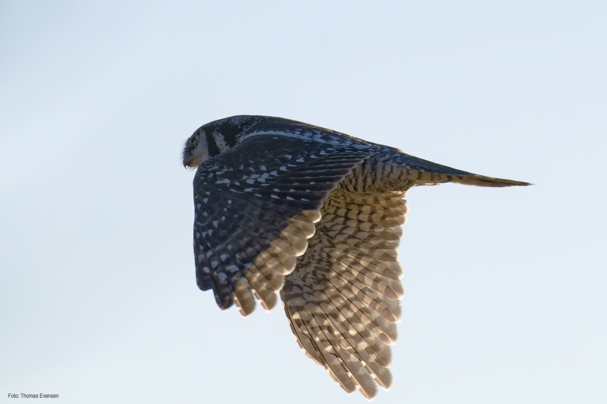
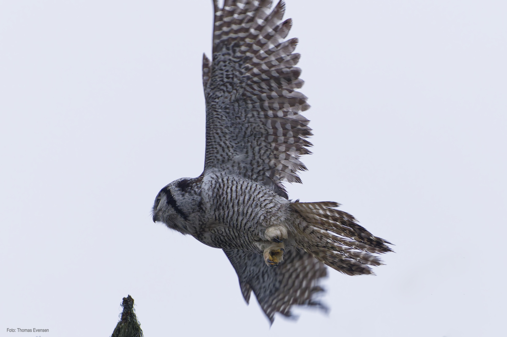
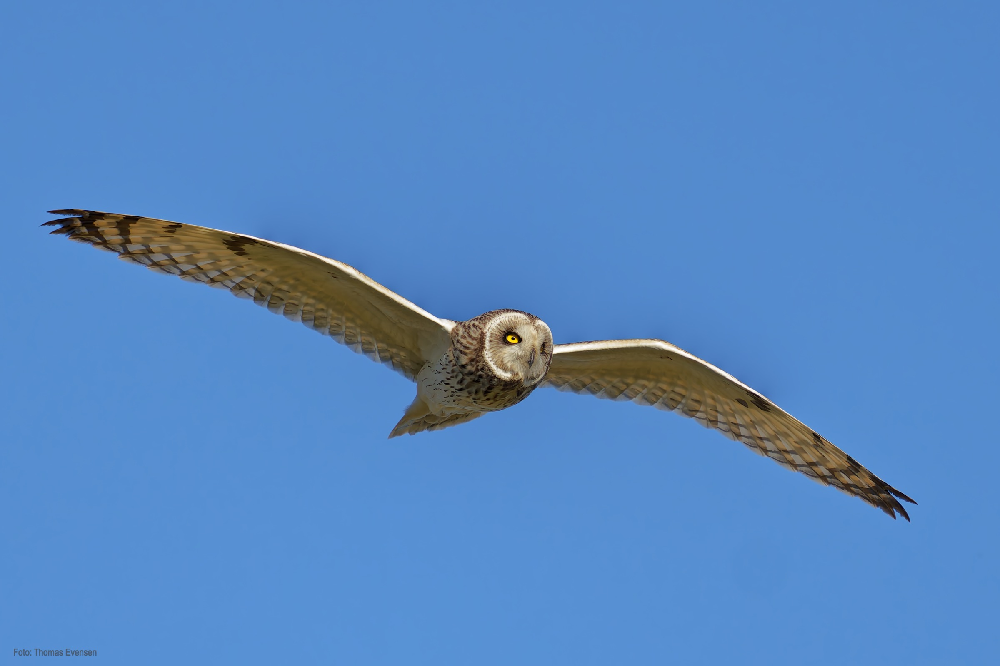
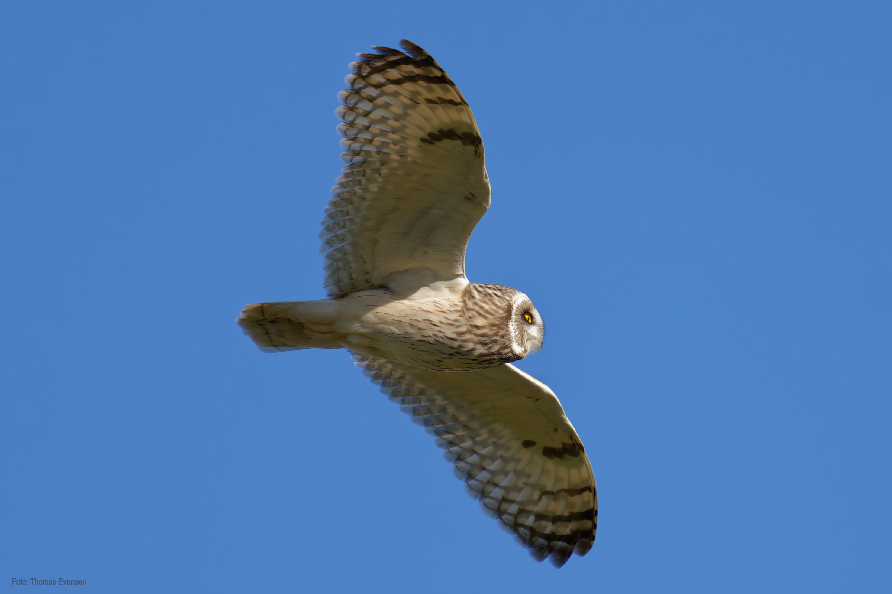
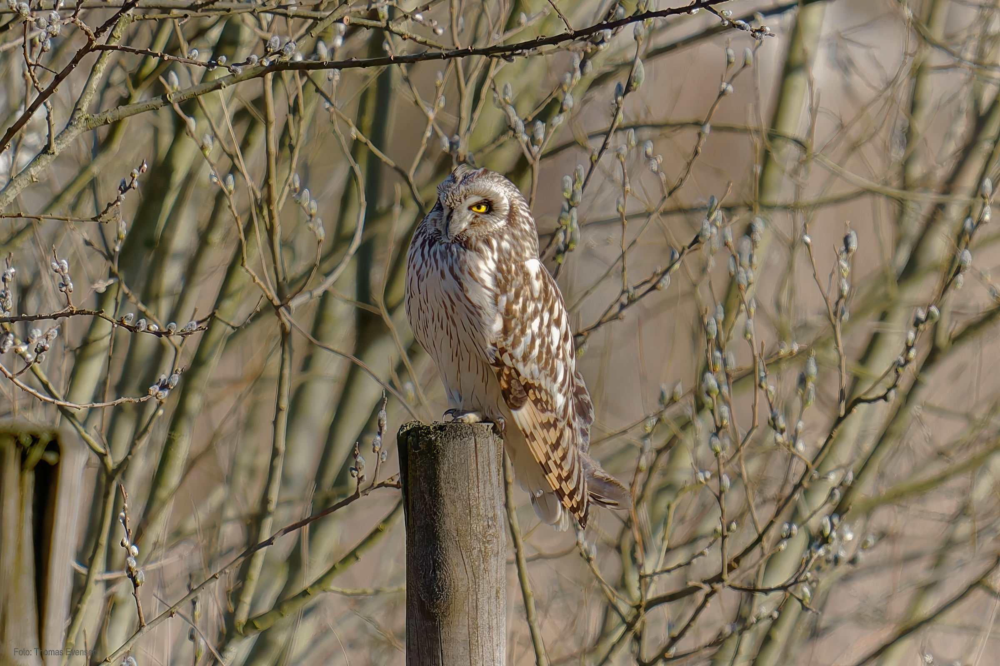
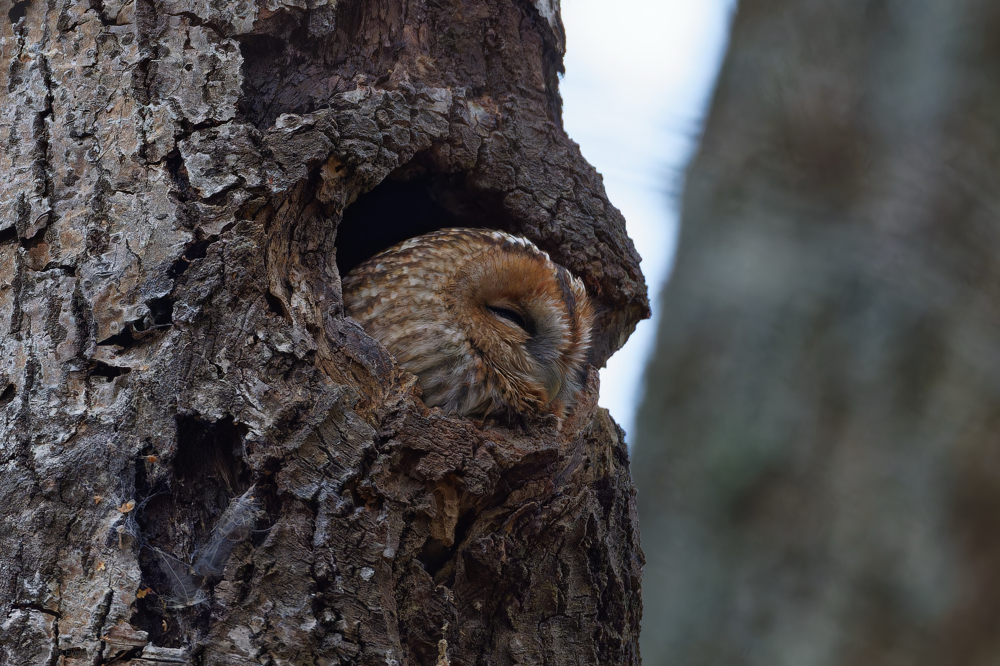
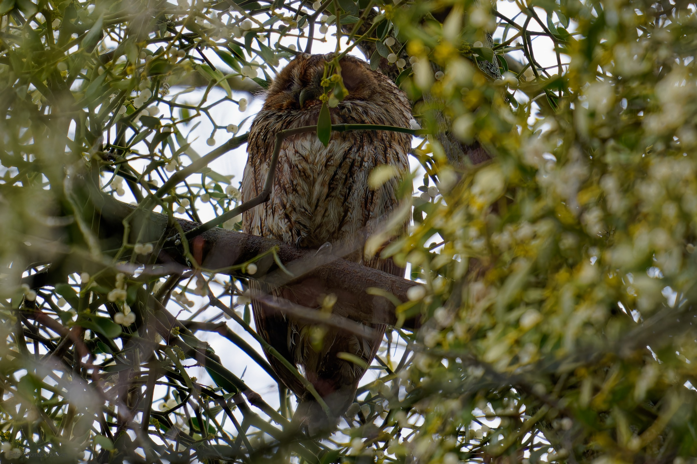
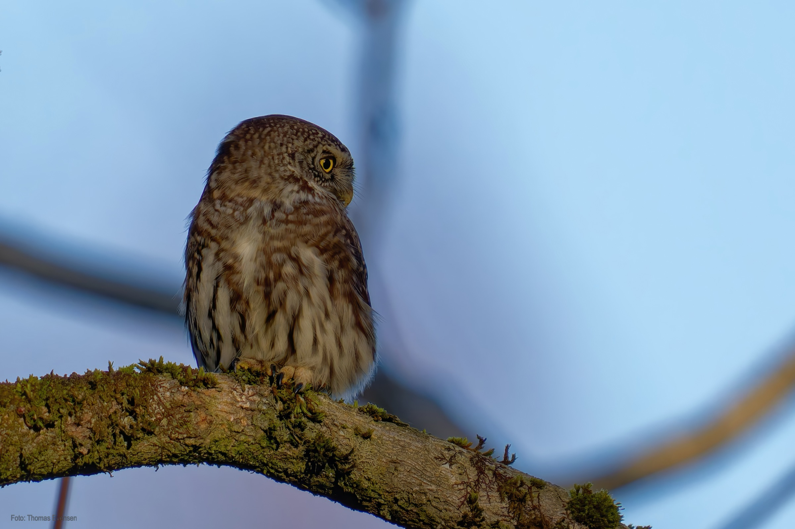
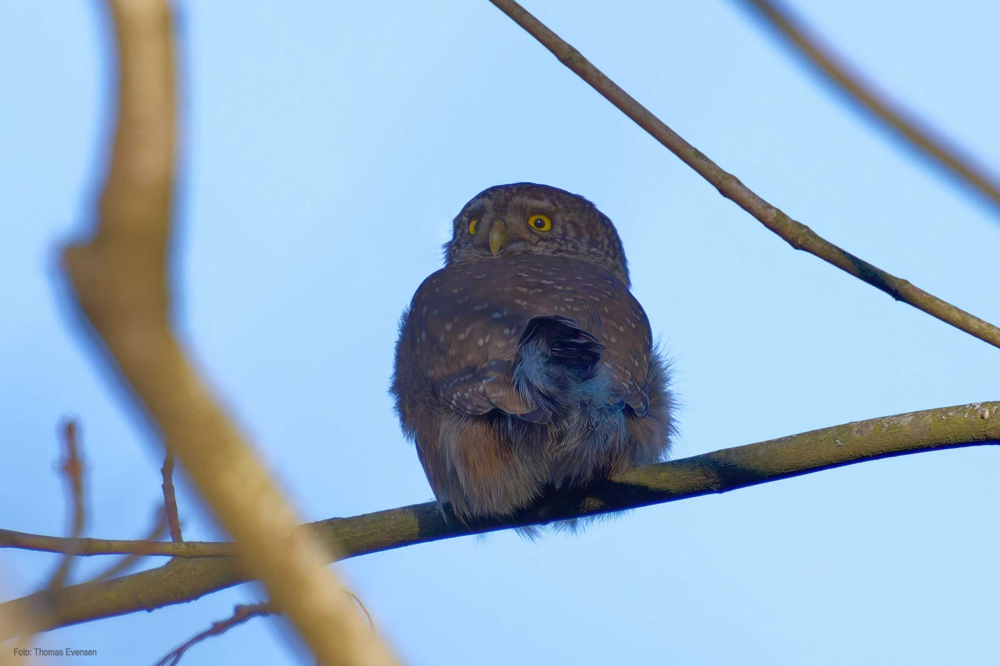
