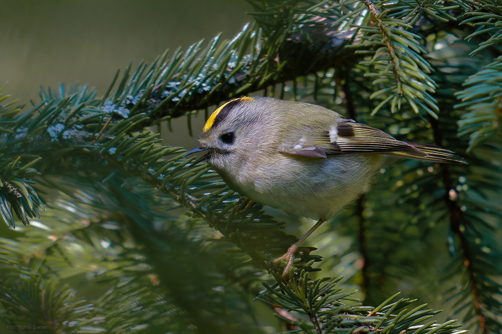
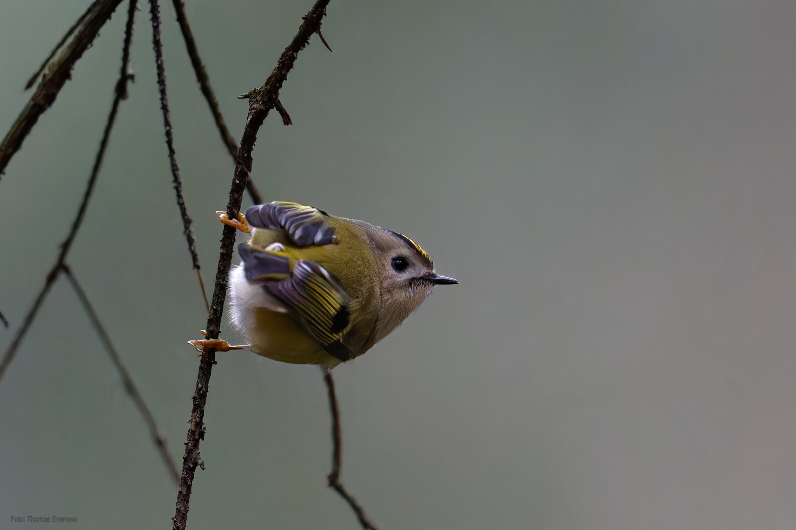
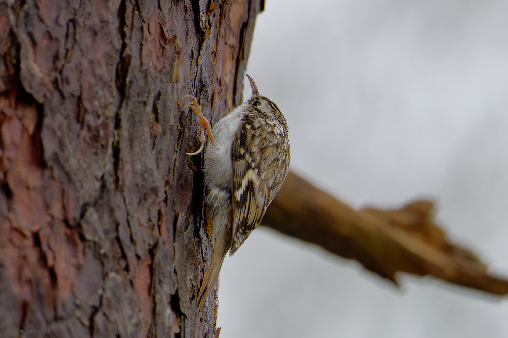
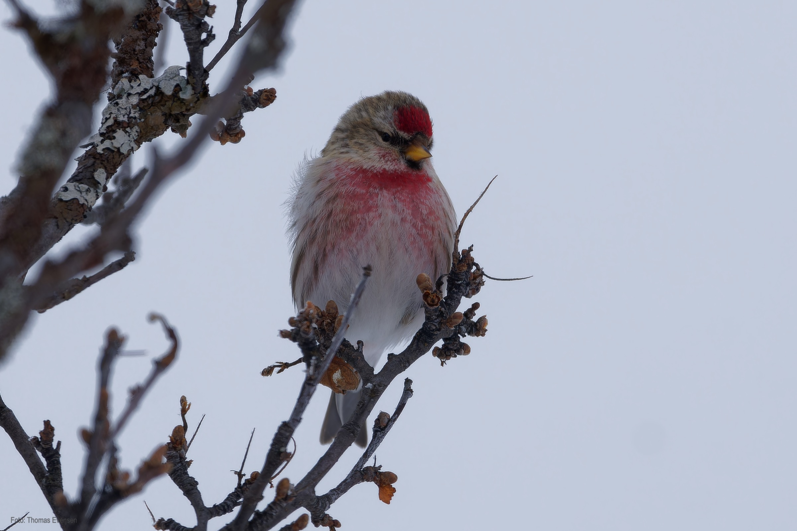
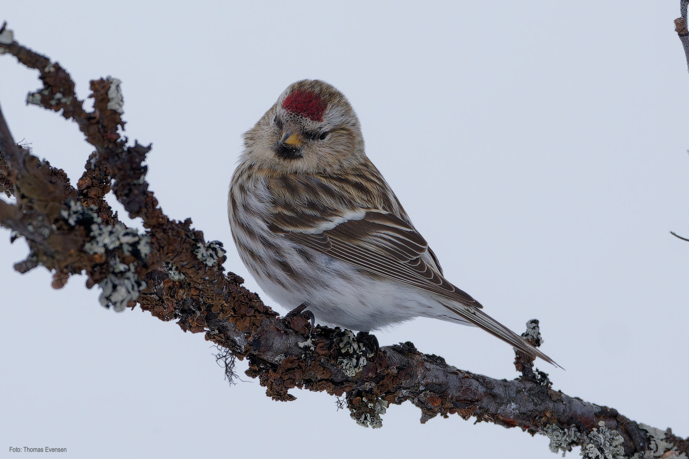
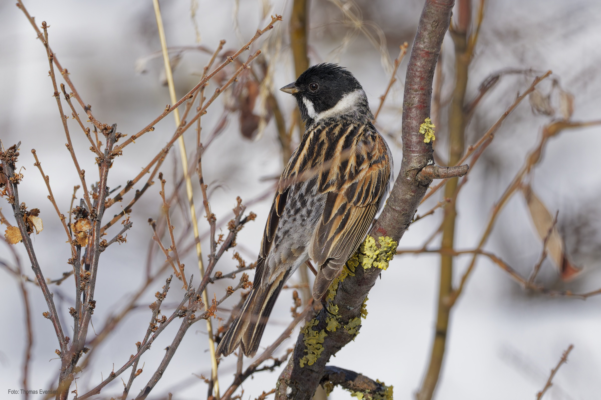
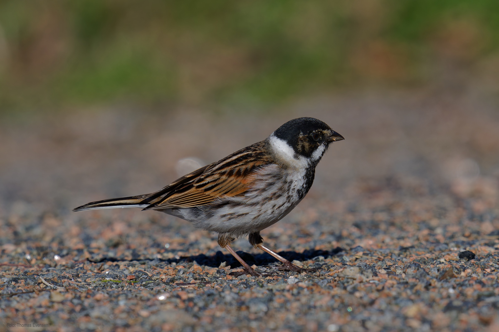
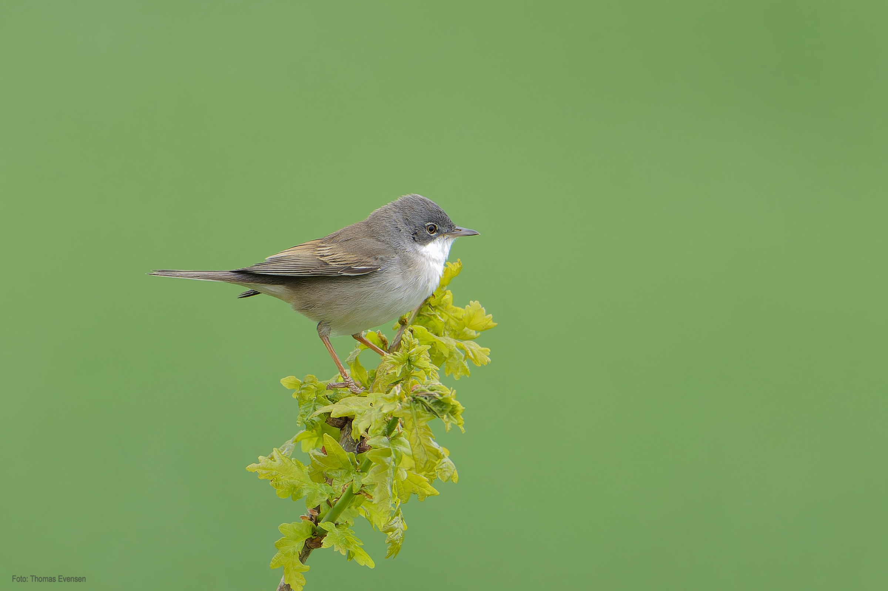

Some other passerine birds.

| Latin      | UK | Norwegian |
| ----------- | ----------- |   ----------- |
| Regulus regulus | [Goldcrest](https://en.wikipedia.org/wiki/Goldcrest) |  [Fuglekonge](https://no.wikipedia.org/wiki/Fuglekonge) |
| Acanthis flammea | [Common redpoll](https://en.wikipedia.org/wiki/Common_redpoll) |  [Gråsisik](https://no.wikipedia.org/wiki/Gråsisik) |
| Emberiza schoeniclus  | [Common reed bunting](https://en.wikipedia.org/wiki/Common_reed_bunting) |   [Sivspurv](https://no.wikipedia.org/wiki/Sivspurv)     |
| Curruca communis  | [Common whitethroat](https://en.wikipedia.org/wiki/Common_whitethroat) |   [Tornsanger](https://no.wikipedia.org/wiki/Tornsanger)     |
| Certhia familiaris | [Eurasian treecreeper](https://en.wikipedia.org/wiki/Eurasian_treecreeper) |  [Trekryper](https://no.wikipedia.org/wiki/Trekryper) |

