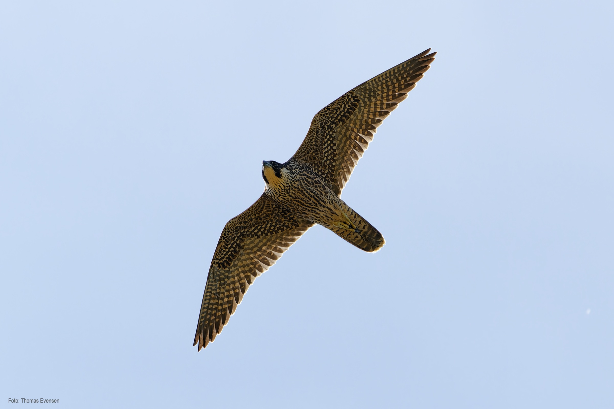
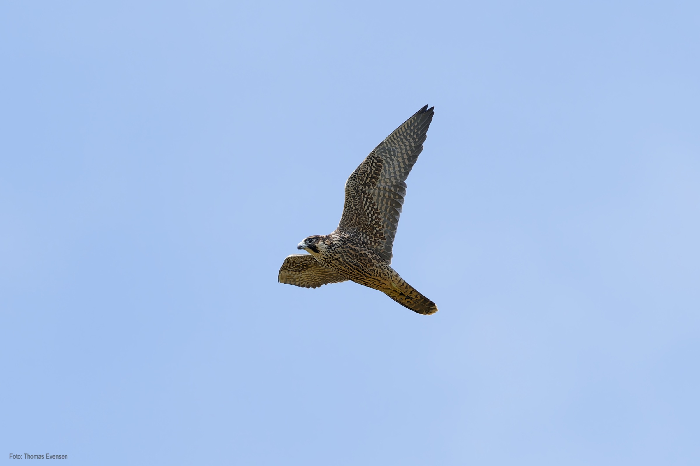

Peregrine falcon, the fastest animal on earth. The falcon can reach a speed up to 350 km/h when hunting. Impressive.

| Latin      | UK | Norwegian |
| ----------- | ----------- |   ----------- |
|  Falco peregrinus |  [Peregrine falcon](https://en.wikipedia.org/wiki/Peregrine_falcon) |  [Vandrefalk](https://no.wikipedia.org/wiki/Vandrefalk) |

