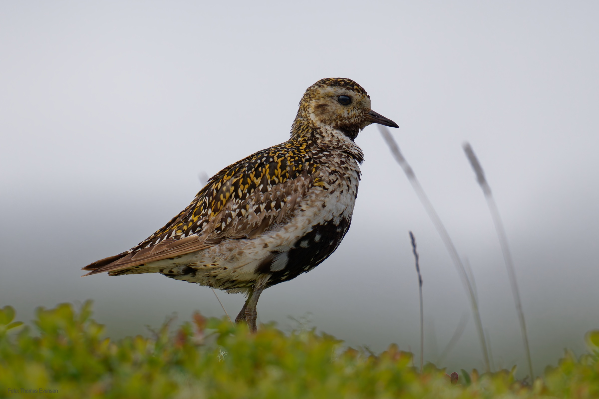
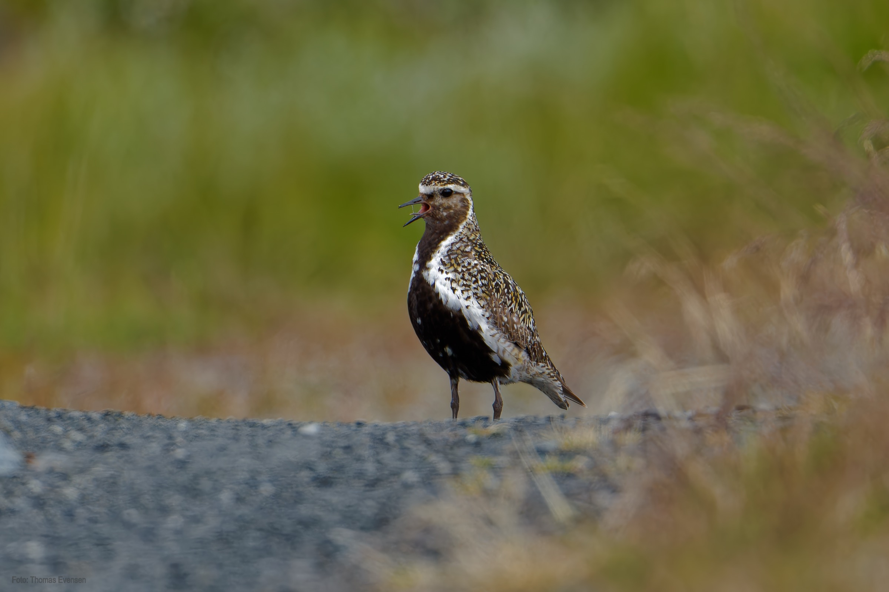
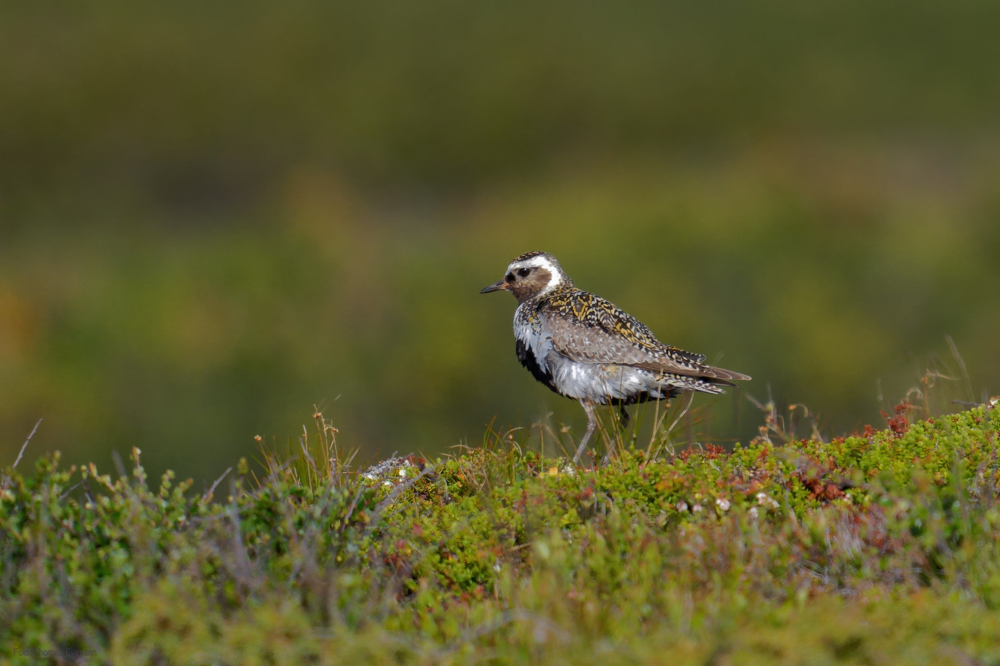

The Plover is a typical mountain bird, if there is one bird I associate with mountain it is the Plover. The Plover
is photgraphed at two places, where I know they are breeding, close to my cabin in the mountain.

| Latin      | UK | Norwegian |
| ----------- | ----------- |   ----------- |
| Pluvialis apricaria | [European golden plover](https://en.wikipedia.org/wiki/European_golden_plover) |  [Heilo](https://no.wikipedia.org/wiki/Heilo) |

