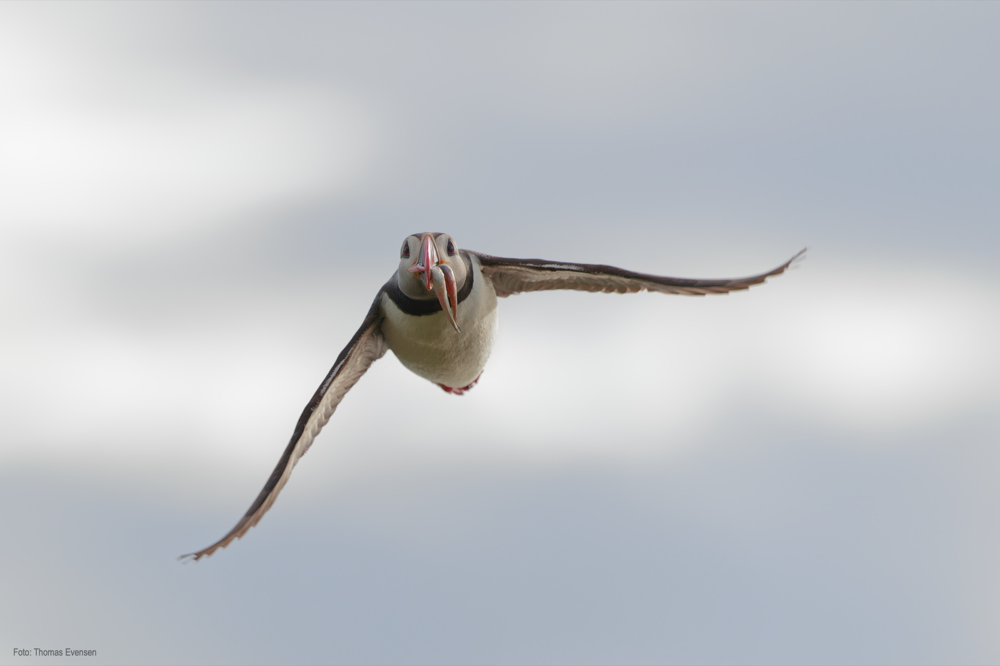
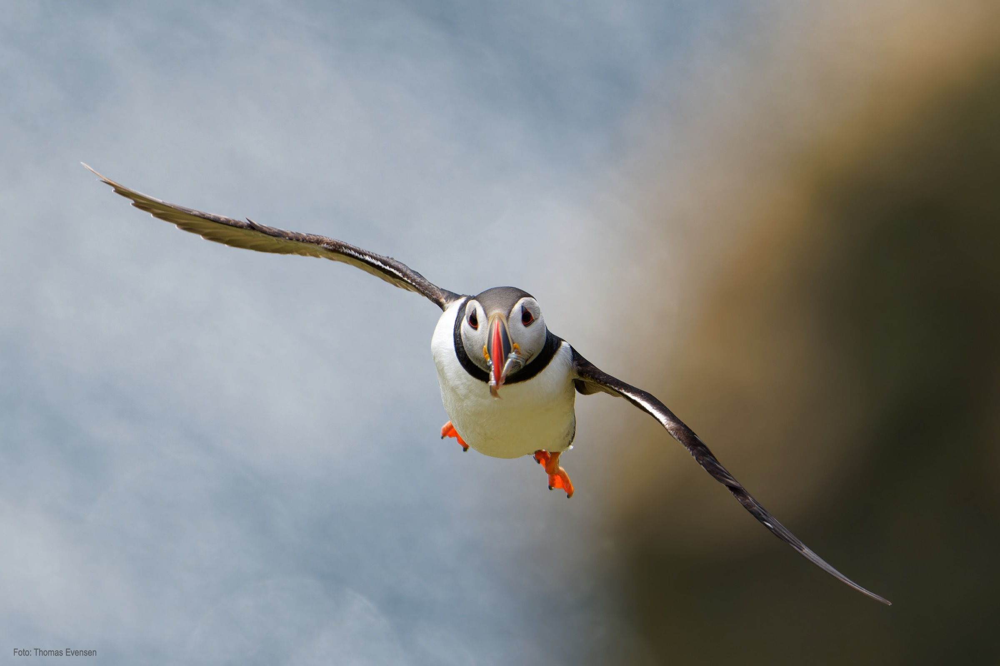
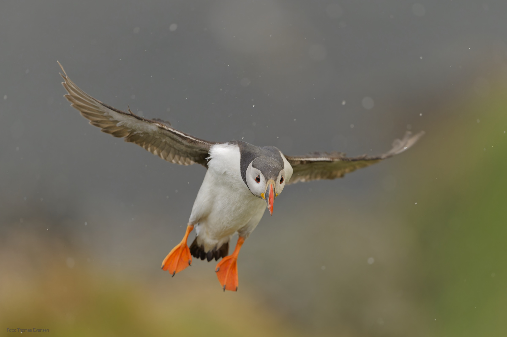
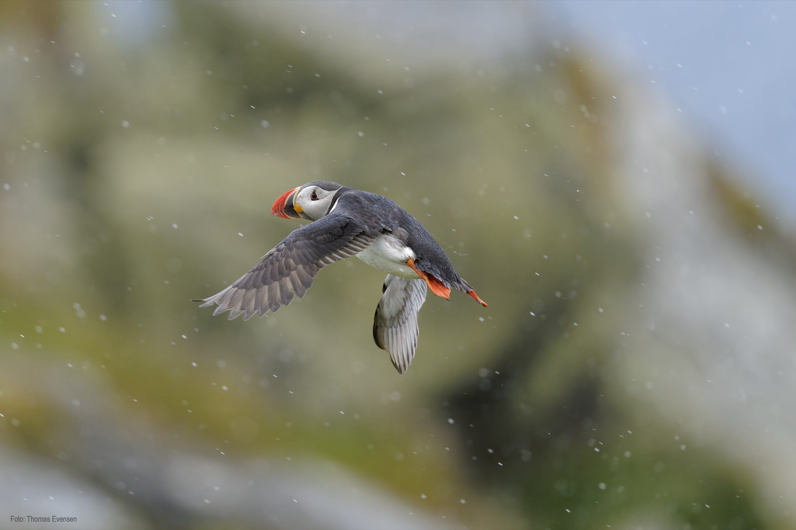
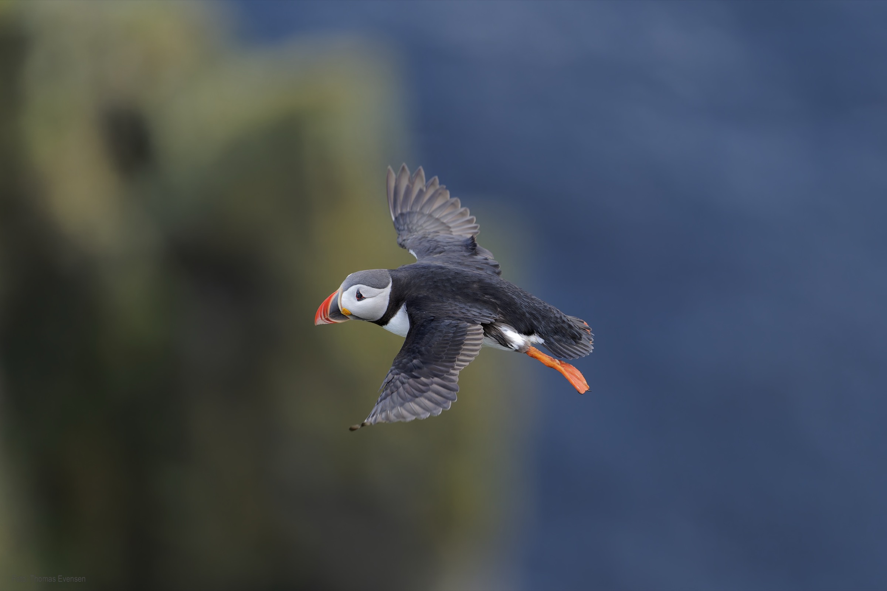
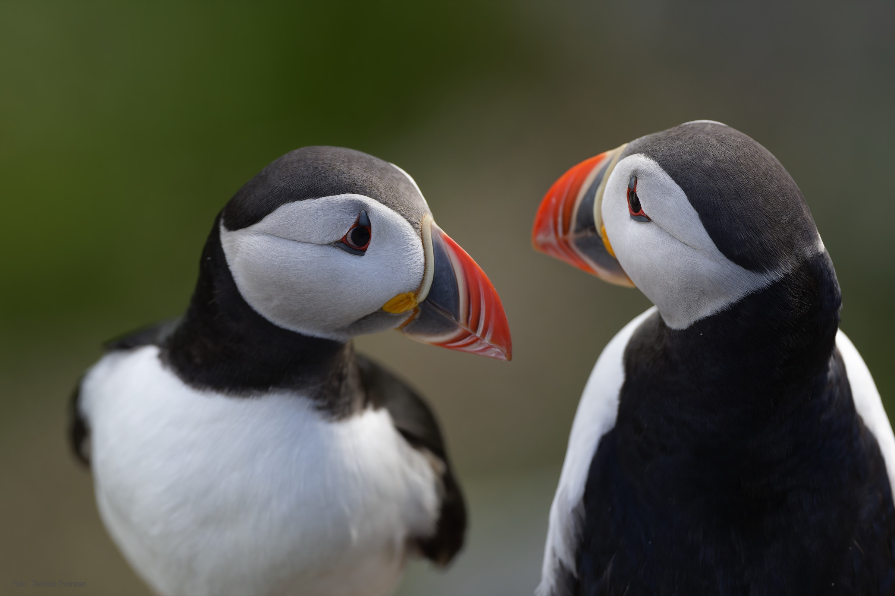

 Puffins at Runde in Norway.

| Latin      | UK | Norwegian |
| ----------- | ----------- |   ----------- |
| Fratercula arctica | [Atlantic puffin](https://en.wikipedia.org/wiki/Atlantic_puffin) |  [Lunde (fugl)](https://no.wikipedia.org/wiki/Lunde_(fugl)) |

