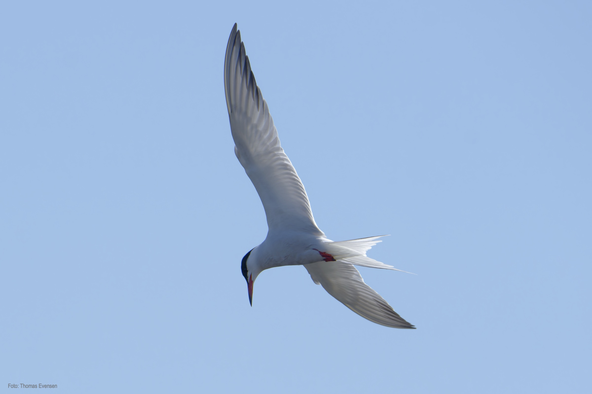
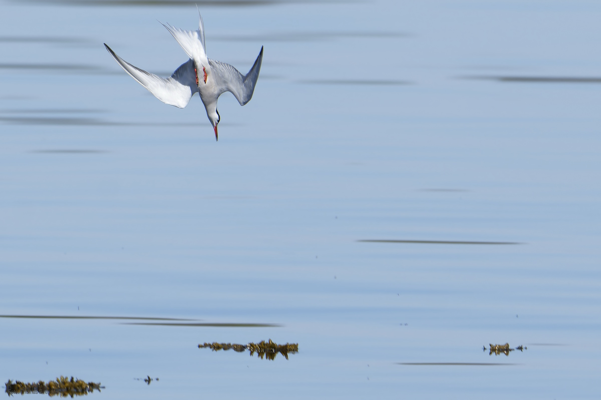
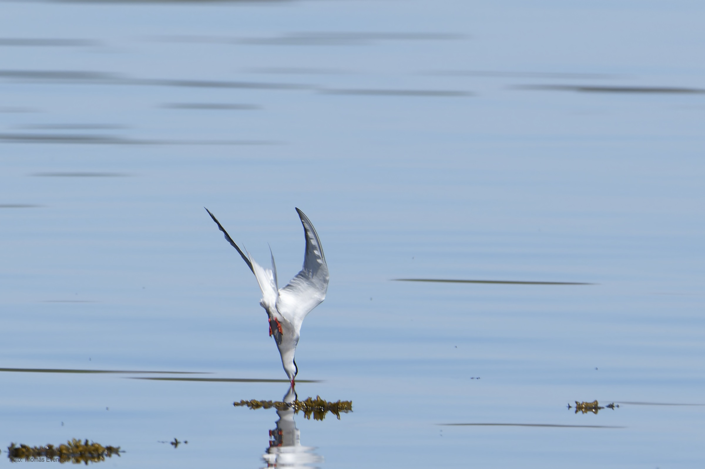
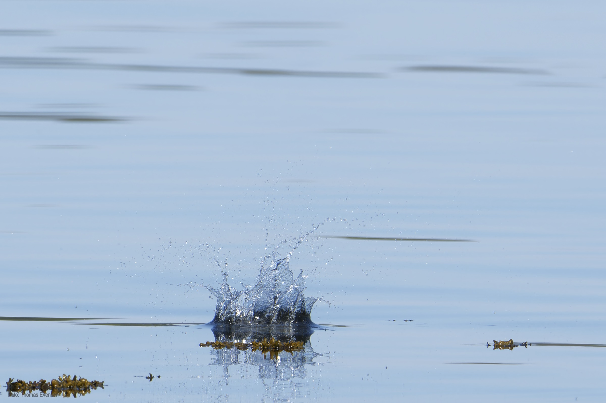
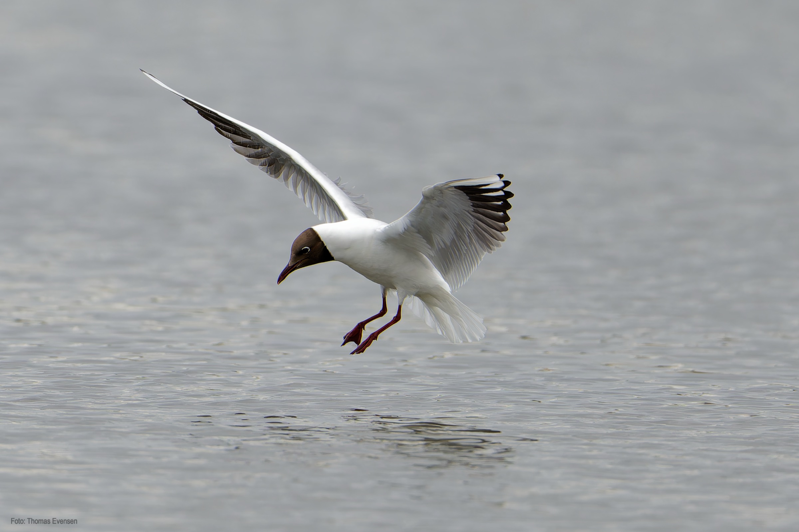
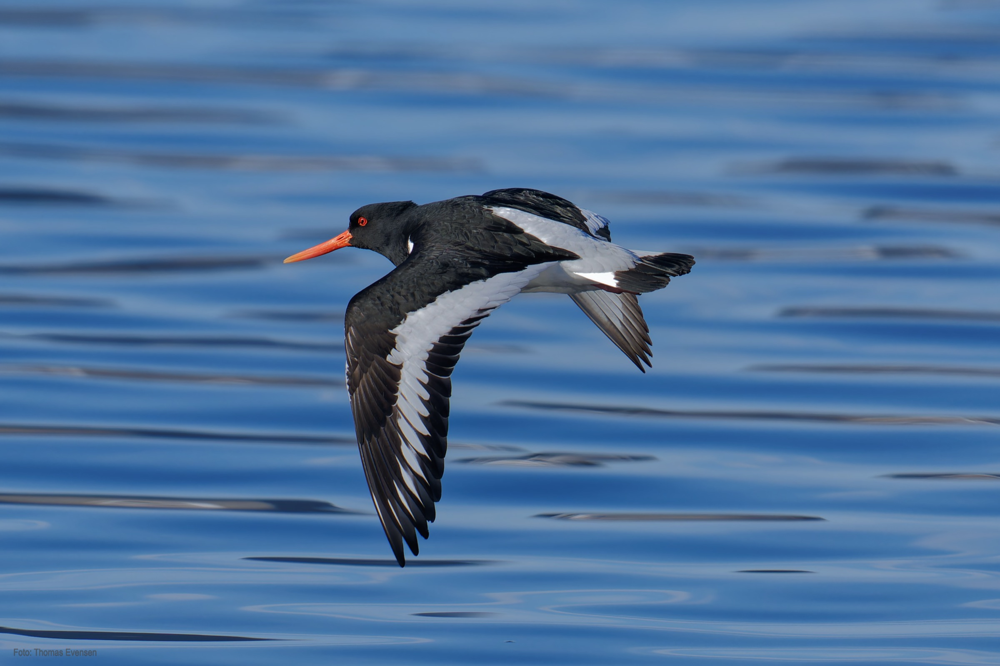
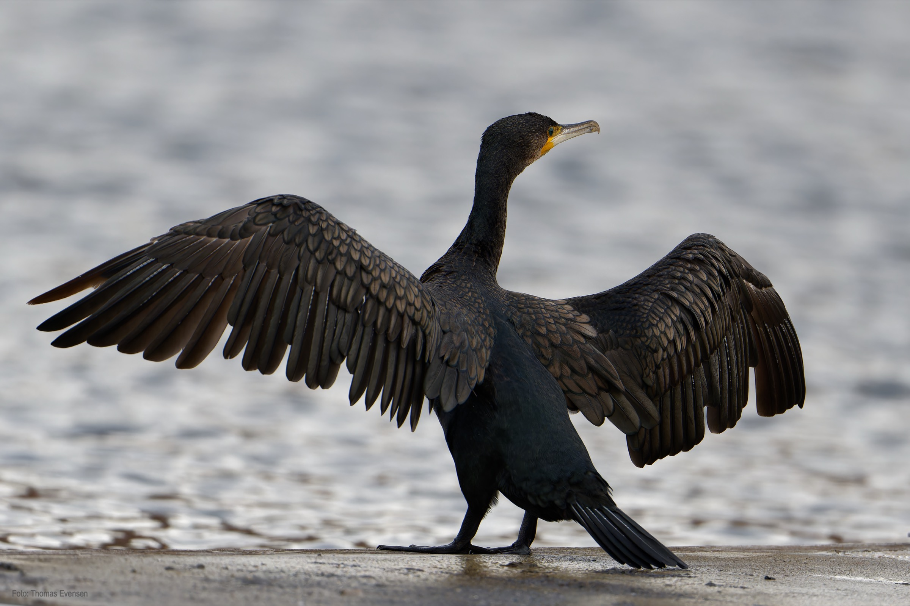
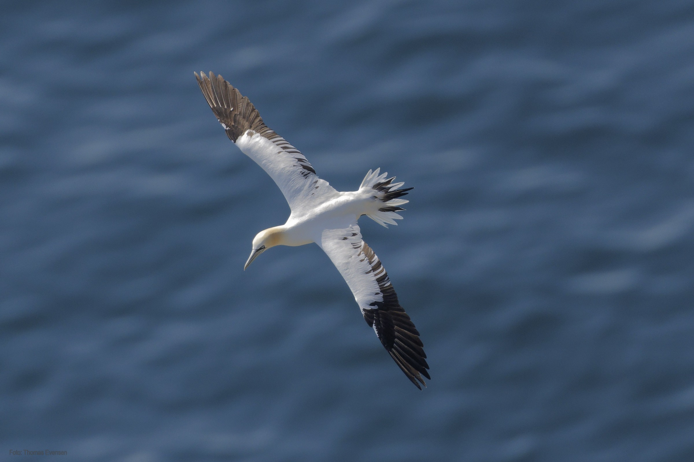

Seabirds.

| Latin      | UK | Norwegian |
| ----------- | ----------- |   ----------- |
| Sterna hirundos  |  [Common tern](https://en.wikipedia.org/wiki/Common_tern) | [Makrellterne](https://no.wikipedia.org/wiki/Makrellterne)    |
| Haematopus ostralegus  |  [Eurasian oystercatcher](https://en.wikipedia.org/wiki/Eurasian_oystercatcher) | [Tjeld](https://no.wikipedia.org/wiki/Tjeld)    |
| Phalacrocorax carbo | [Great Cormorant](https://en.wikipedia.org/wiki/Great_cormorant) | [Storskarv](https://no.wikipedia.org/wiki/Storskarv) |
| Chroicocephalus ridibundus | [Black-headed gull](https://en.wikipedia.org/wiki/Black-headed_gull) | [Hettemåke](https://no.wikipedia.org/wiki/Hettem%C3%A5ke) |
| Morus bassanus | [Northern gannet](https://en.wikipedia.org/wiki/Northern_gannet) | [Havsule](https://no.wikipedia.org/wiki/Havsule) |

