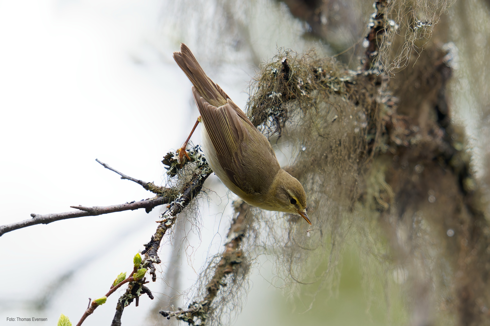
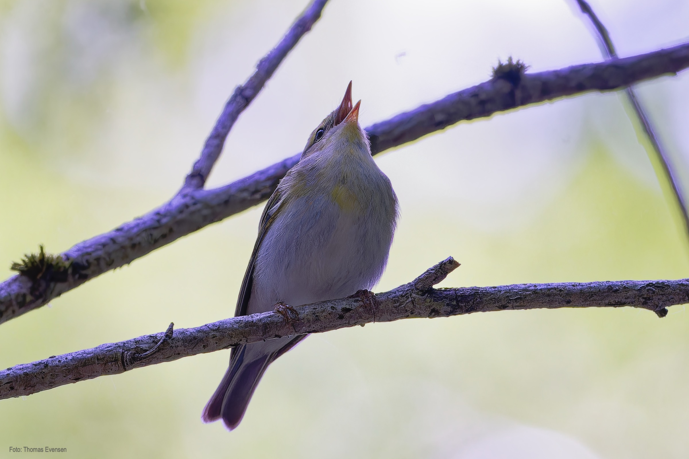
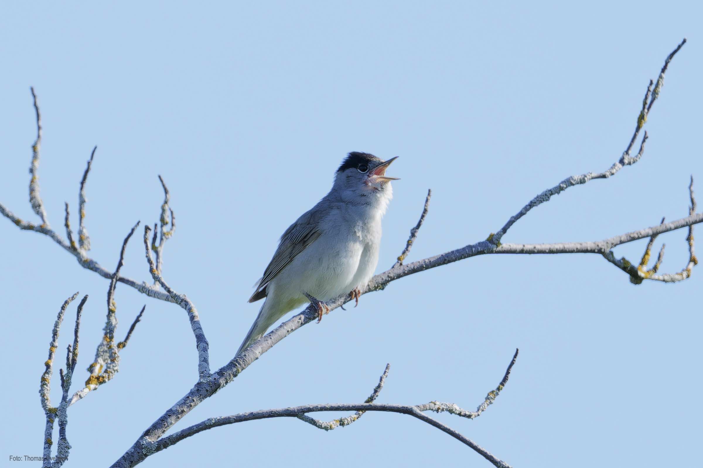

Western yellow wagtail,  White wagtail, Citrine wagtail, Grey wagtail. The Citrine Wagtail is not seen often in Norway. The picture of the Citrine Wagtail was at that time the first observation in Norway.

| Latin      | UK  | Norwegian |
| ----------- | ----------- |   ----------- |
| Phylloscopus trochilus | [Willow warbler](https://en.wikipedia.org/wiki/Willow_warbler) |  [Løvsanger ](https://no.wikipedia.org/wiki/Løvsanger) |
| Phylloscopus sibilatrix | [Wood warbler](https://en.wikipedia.org/wiki/Wood_warbler) |  [Bøksanger ](https://no.wikipedia.org/wiki/Bøksanger) |
| Sylvia atricapilla | [Eurasian blackcap](https://en.wikipedia.org/wiki/Eurasian_blackcap) |  [Munk ](https://no.wikipedia.org/wiki/Munk_(fugl)) |

