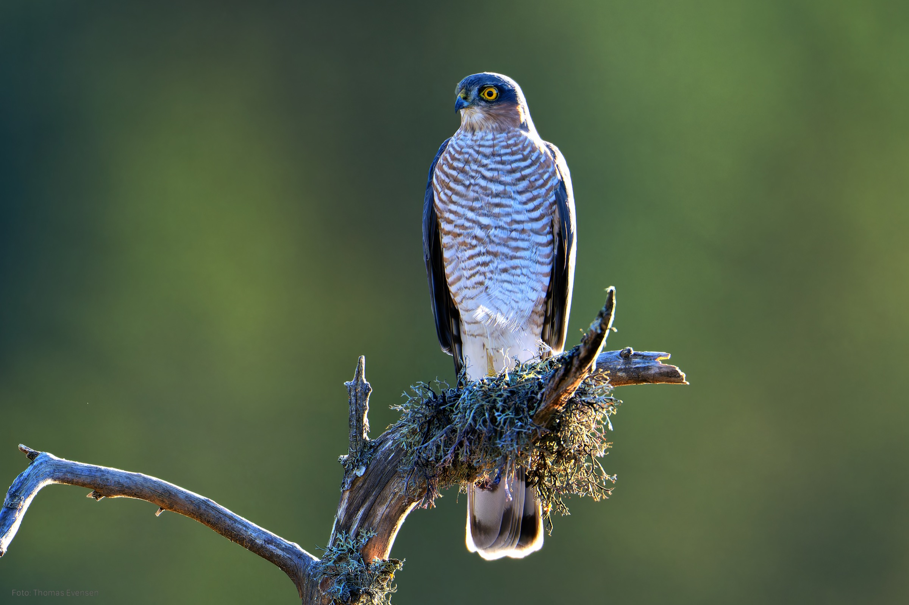
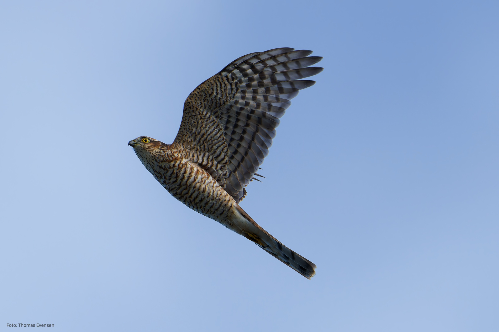
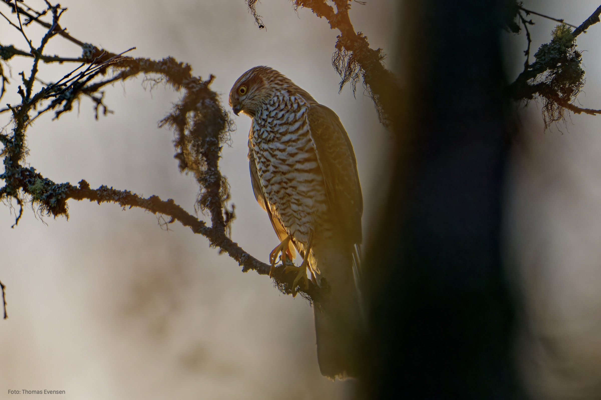
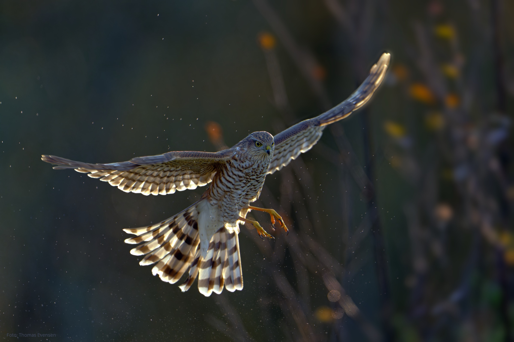

Eurasian sparrowhawk.

| Latin      | UK | Norwegian |
| ----------- | ----------- |   ----------- |
|  Accipiter nisus |  [Eurasian sparrowhawk](https://en.wikipedia.org/wiki/Eurasian_sparrowhawk) |  [Spurvehauk](https://no.wikipedia.org/wiki/Spurvehauk) |

