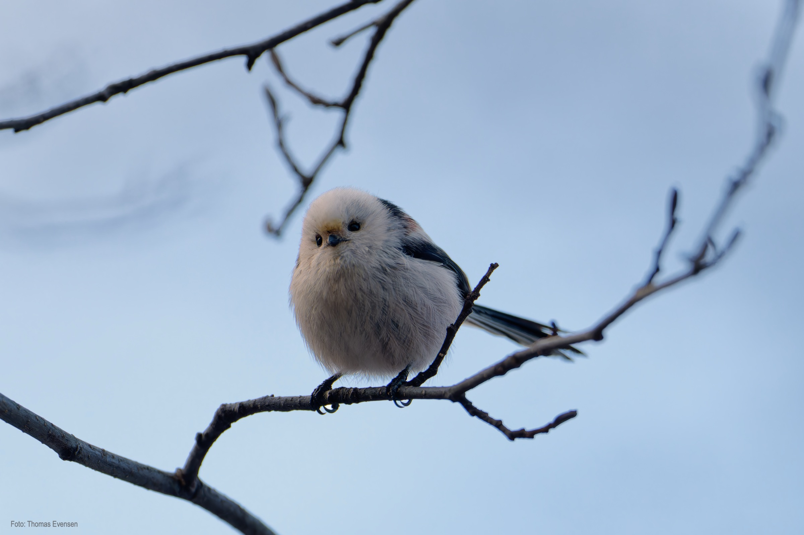
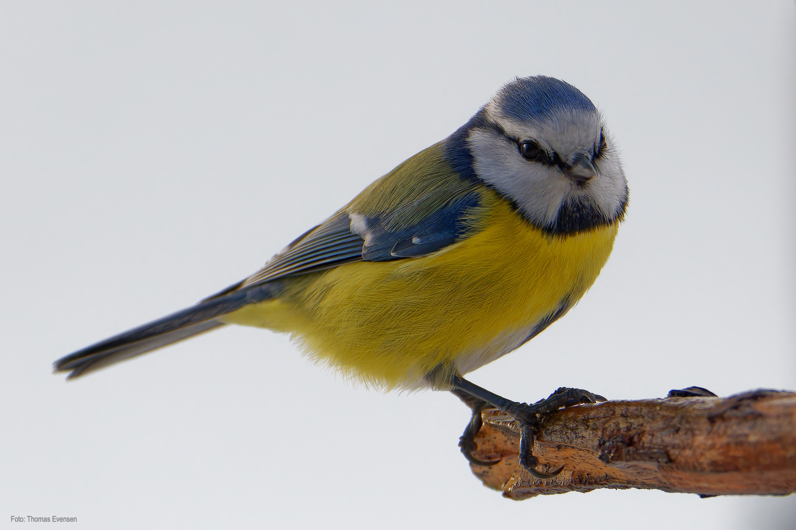
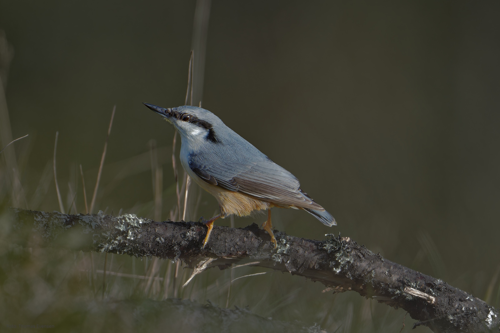
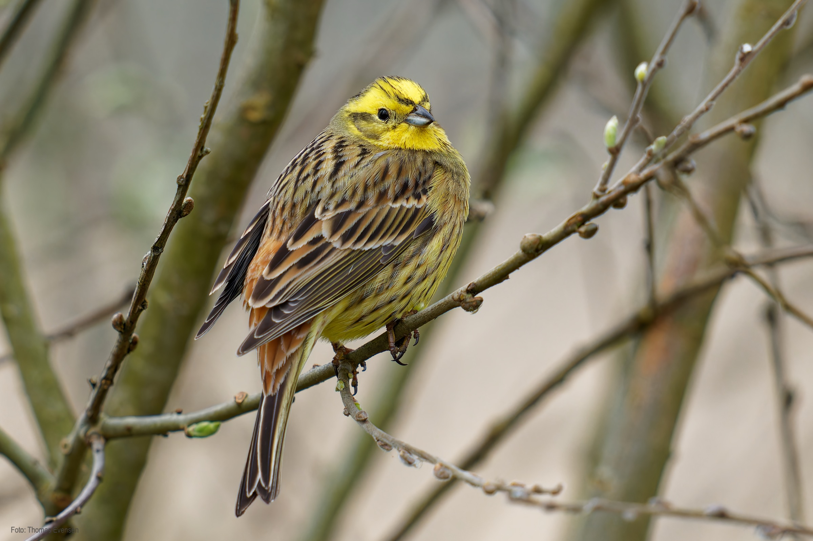

Eurasian nuthatch, Eurasian blue tit,  Long-tailed tit and yellowhammer.

| Latin      | UK | Norwegian |
| ----------- | ----------- |   ----------- |
| Cyanistes caeruleus | [Eurasian blue tit](https://en.wikipedia.org/wiki/Eurasian_blue_tit) |  [Blåmeis](https://no.wikipedia.org/wiki/Blåmeis) |
| Aegithalos caudatus | [Long-tailed tit](https://en.wikipedia.org/wiki/Long-tailed_tit) |  [Stjertmeis](https://nn.wikipedia.org/wiki/Stjertmeis) |
| Sitta europaea | [Eurasian nuthatch](https://en.wikipedia.org/wiki/Eurasian_nuthatch) |  [Spettmeis](https://no.wikipedia.org/wiki/Spettmeis) |
| Emberiza citrinella | [Yellowhammer](https://en.wikipedia.org/wiki/Yellowhammer) |  [Gulspurv](https://no.wikipedia.org/wiki/Gulspurv) |

