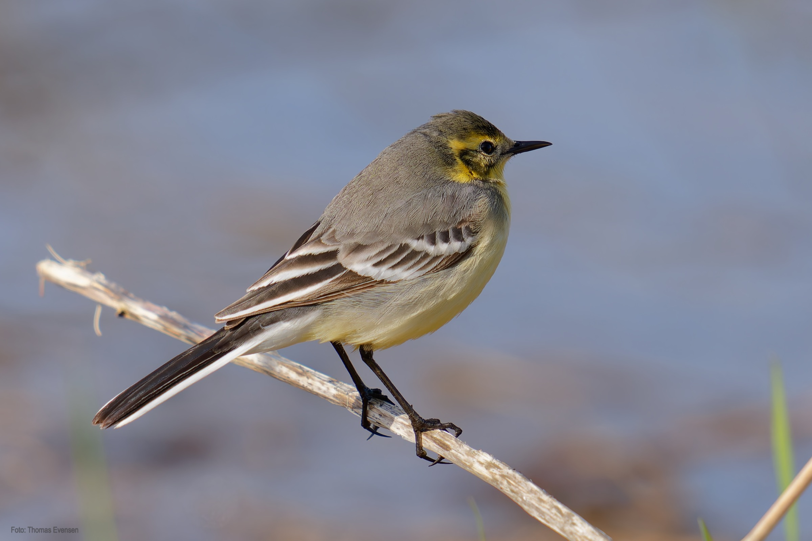
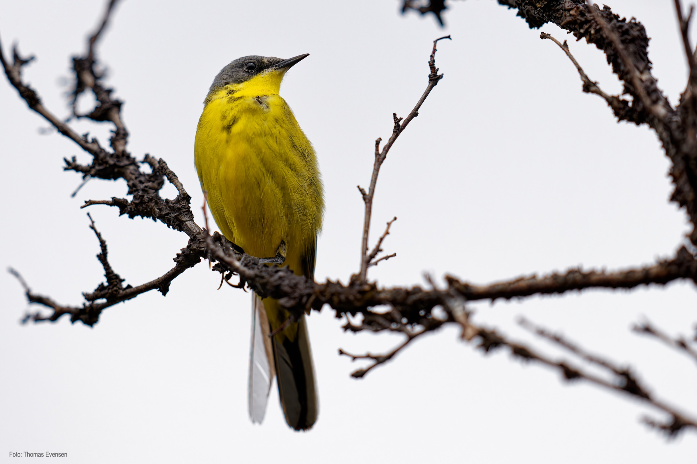
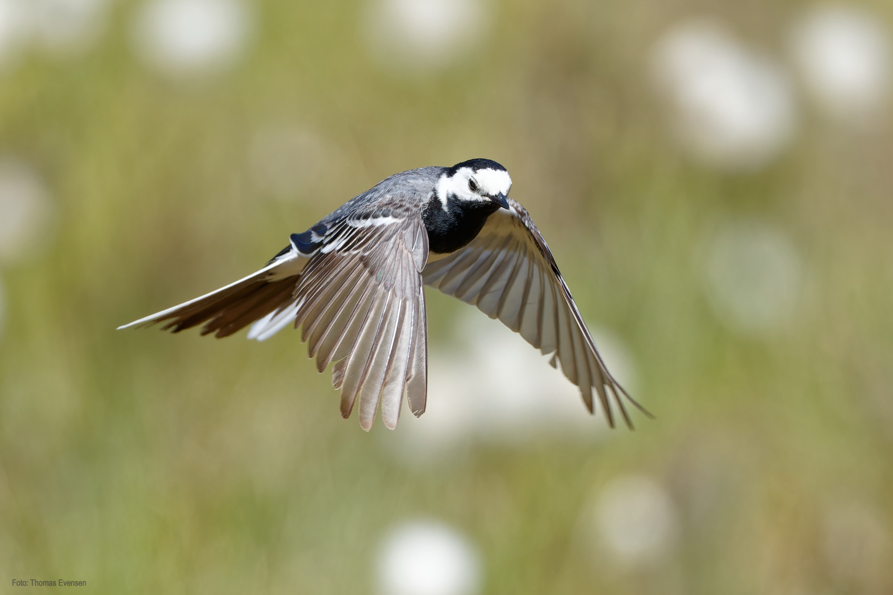
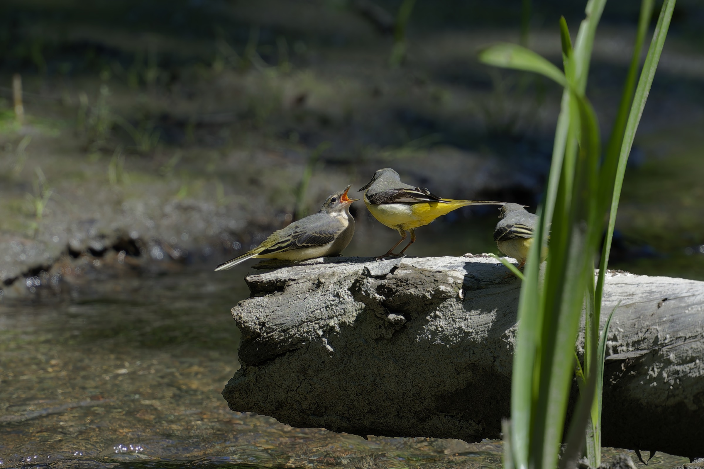
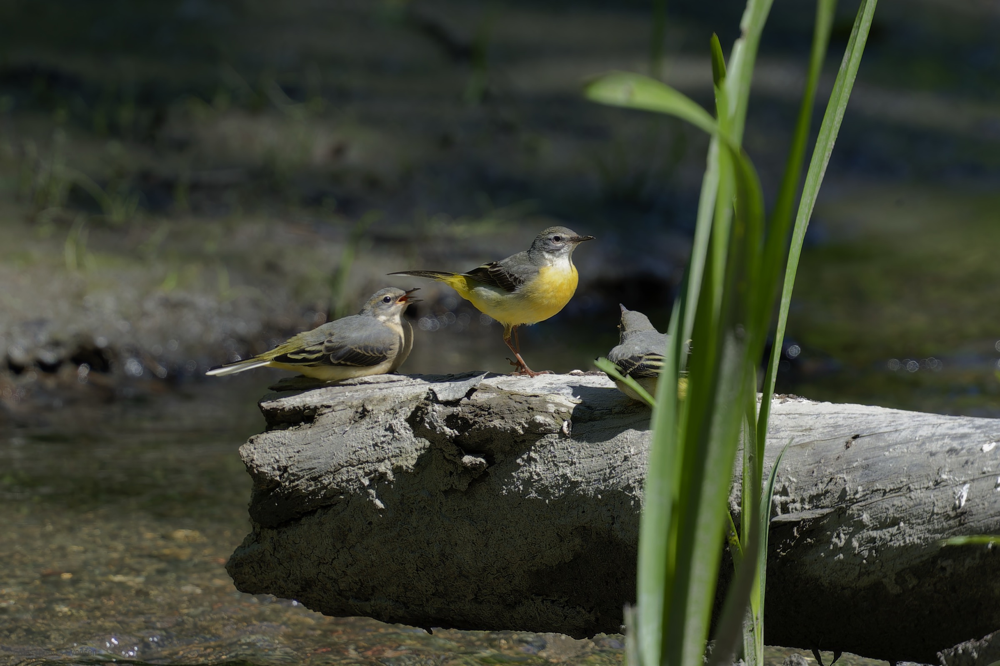

Western yellow wagtail,  White wagtail, Citrine wagtail, Grey wagtail. The Citrine Wagtail is not seen often in Norway. The picture of the Citrine Wagtail was at that time the first observation in Norway.

| Latin      | UK  | Norwegian |
| ----------- | ----------- |   ----------- |
| Motacilla flava | [Western yellow wagtail ](https://en.wikipedia.org/wiki/Western_yellow_wagtail) |  [Gulerle ](https://no.wikipedia.org/wiki/Gulerle) |
| Motacilla alba | [White wagtail](https://en.wikipedia.org/wiki/White_wagtail) |  [Linerle ](https://no.wikipedia.org/wiki/Linerle) |
| Motacilla citreola | [Citrine wagtail](https://en.wikipedia.org/wiki/Citrine_wagtail) |  [Sitronerle ](https://no.wikipedia.org/wiki/Sitronerle) |
| Motacilla cinerea | [Grey wagtail](https://en.wikipedia.org/wiki/Grey_wagtail) | [Vintererle ](https://no.wikipedia.org/wiki/Vintererle) |

