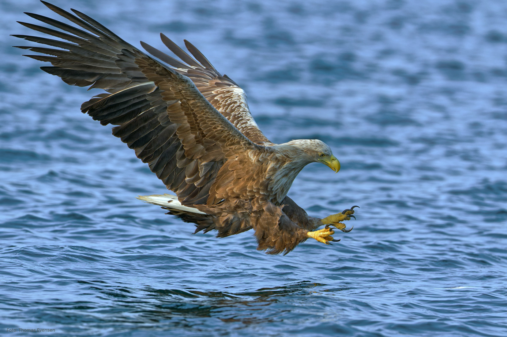
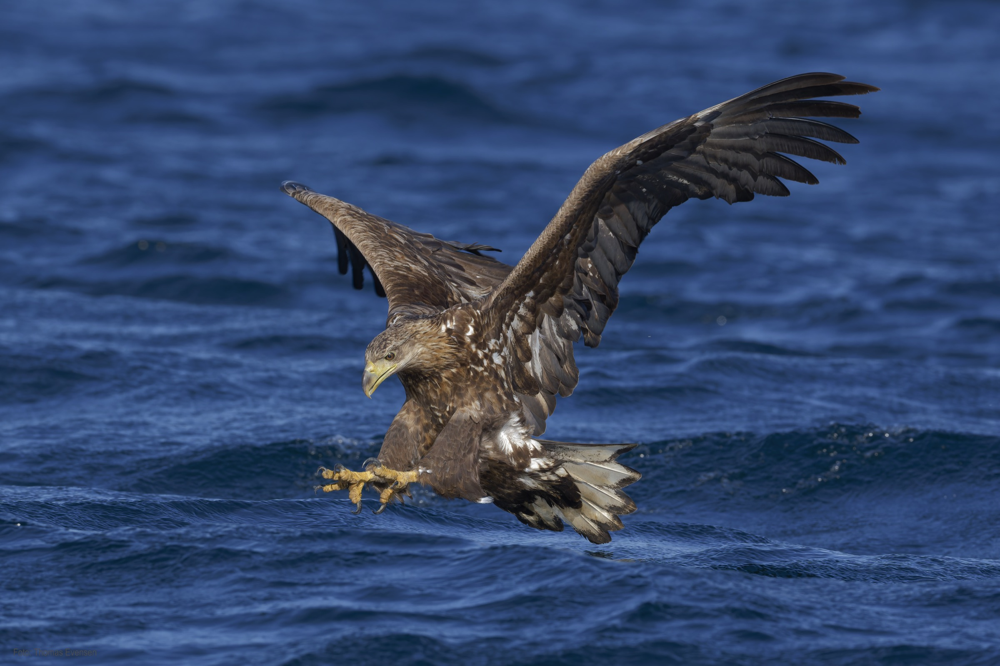
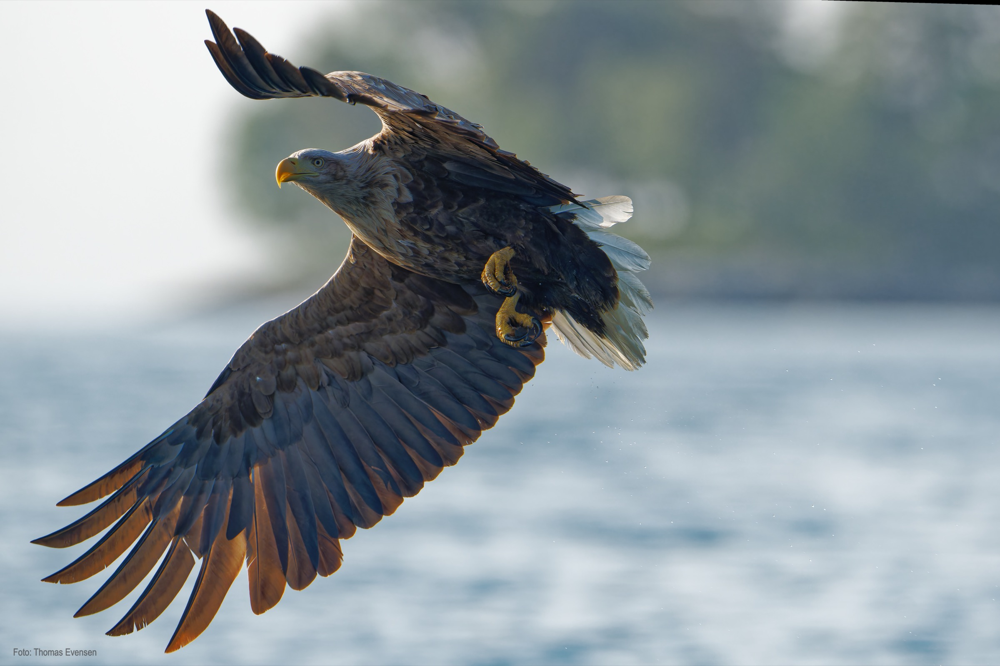
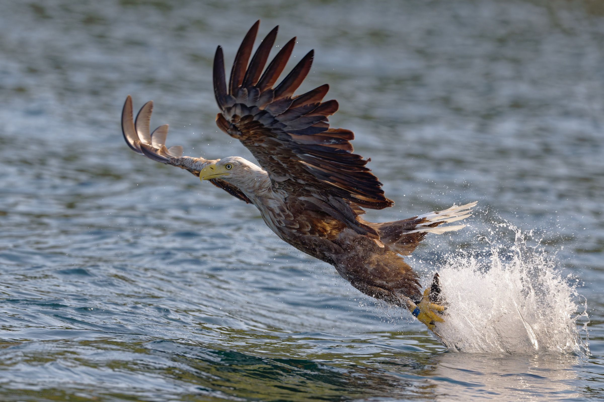
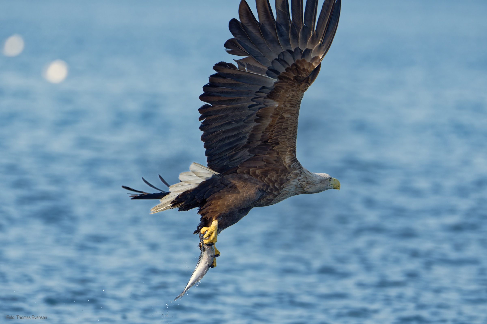

White-tailed eagle is the biggest bird in Norway. It is even bigger than the golden eagle.

# Wikipedia

| Latin      | UK | Norwegian |
| ----------- | ----------- |   ----------- |
| Haliaeetus albicilla |  [White-tailed eagle](https://en.wikipedia.org/wiki/White-tailed_eagle) | [Havørn](https://no.wikipedia.org/wiki/Hav%C3%B8rn) |

# Gallery

