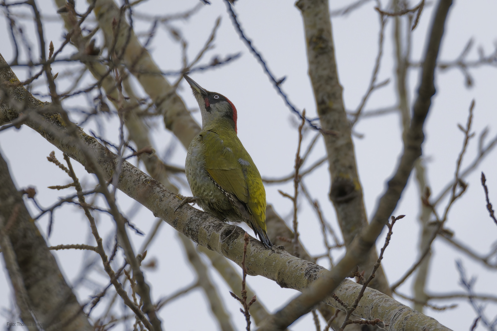
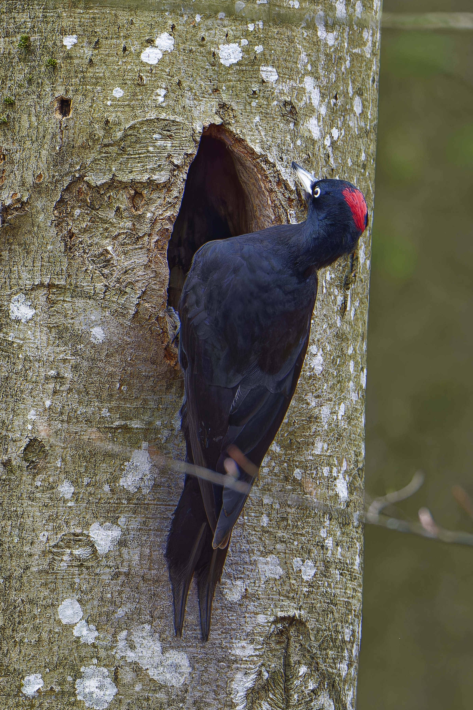
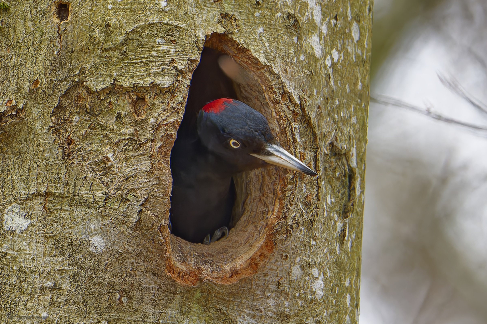
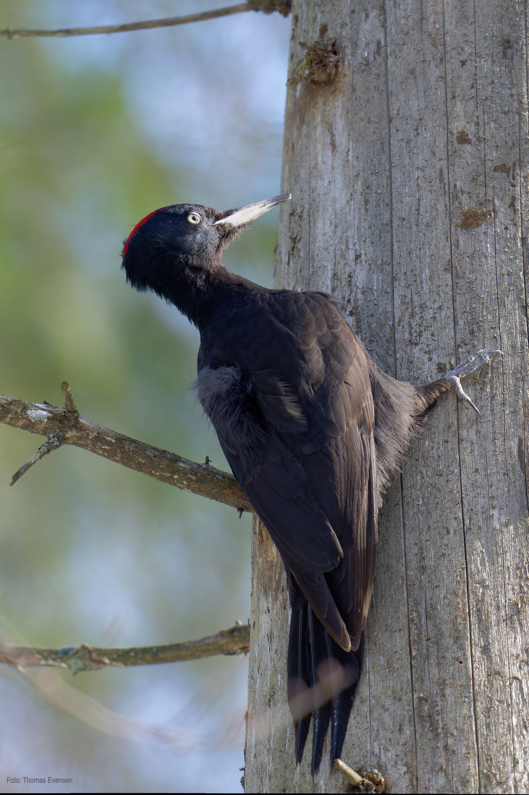
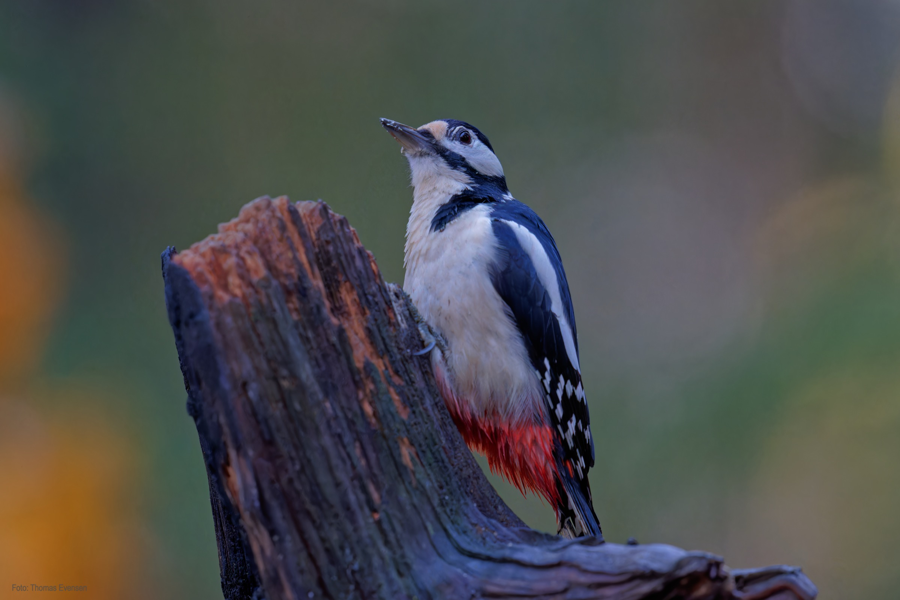
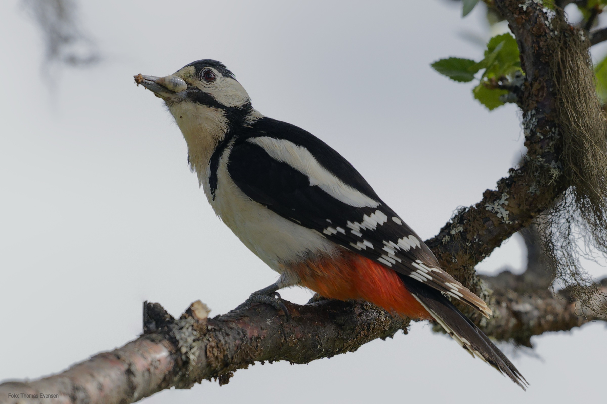
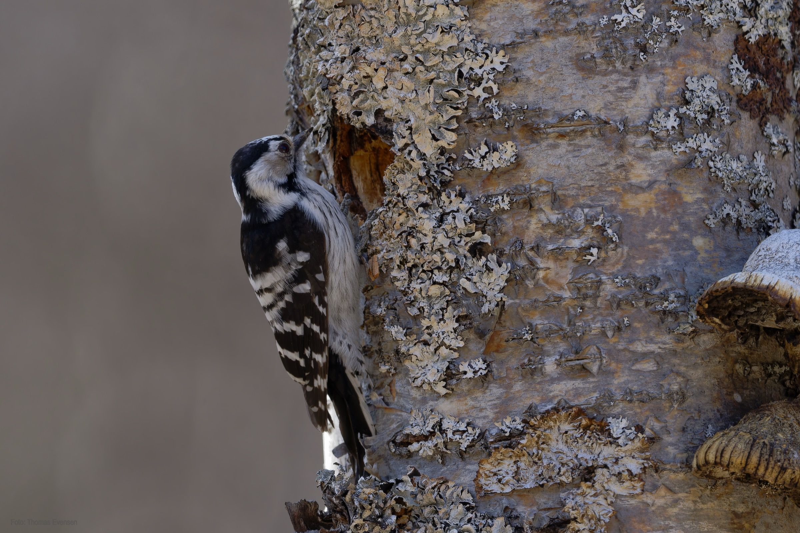
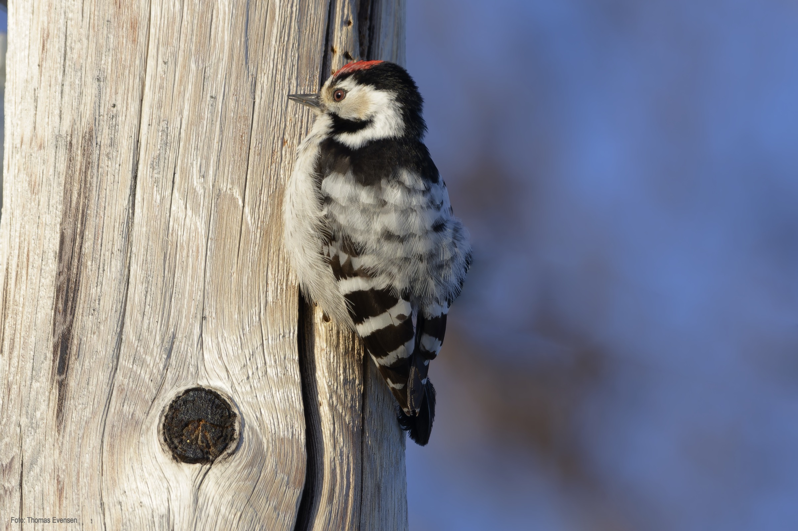

Black woodpecker, European green woodpecker, Lesser spotted woodpecker, Great spotted woodpecker.

| Latin      | UK | Norwegian |
| ----------- | ----------- |   ----------- |
| Dryocopus martius | [Black woodpecker](https://en.wikipedia.org/wiki/Black_woodpecker) |  [Svartspett](https://no.wikipedia.org/wiki/Svartspett) |
| Picus viridis | [European green woodpecker](https://en.wikipedia.org/wiki/European_green_woodpecker) |  [Grønnspett](https://no.wikipedia.org/wiki/Grønnspett) |
| Picoides minor) | [Lesser spotted woodpecker](https://en.wikipedia.org/wiki/Lesser_spotted_woodpecker) |  [Dvergspett](https://no.wikipedia.org/wiki/Dvergspett) |
| Dendrocopos major | [Great spotted woodpecker](https://en.wikipedia.org/wiki/Great_spotted_woodpecker) |  [Flaggspett](https://no.wikipedia.org/wiki/Flaggspett) |

